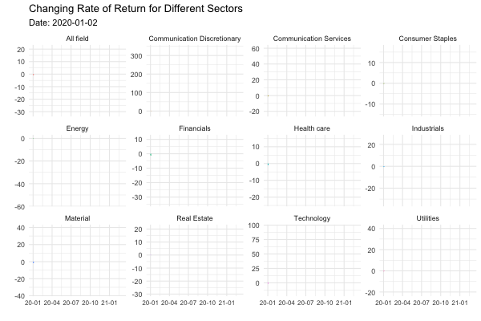
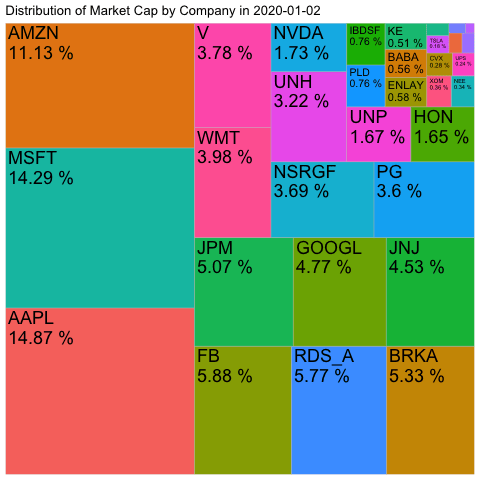

```{r setup, include=FALSE}
knitr::opts_chunk$set(echo = TRUE, error=FALSE, message=FALSE, warning=FALSE)
```

```{r}
library(tidyverse)     # for data cleaning and plotting
library(lubridate)     # for date manipulation
library(openintro)     # for the abbr2state() function
library(gplots)        # for col2hex() function
library(RColorBrewer)  # for color palettes
library(ggthemes)      # for more themes (including theme_map())
library(plotly)        # for the ggplotly() - basic interactivity
library(gganimate)     # for adding animation layers to ggplots
library(transformr)    # for "tweening" (gganimate)
library(gifski)        # need the library for creating gifs but don't need to load each time
library(shiny)         # for creating interactive apps
library(lubridate)     # for date manipulation
library(ggthemes)      # for even more plotting themes
library(janitor)  
library(treemapify)
theme_set(theme_minimal())
```


```{r, echo=FALSE}
##: Here is the information about every company that we are doing
AAPL <- read_csv("AAPL.csv")
AAPL <- AAPL%>% 
  select(-Open, -High, -Low, -`Adj Close`) %>% 
  mutate(Sector = "Technology",
         Company = "AAPL") %>% 
  mutate(return = (Close - 75.0875)/ 75.0875 * 100) %>% 
  mutate(shares = 17001802000) %>% 
  mutate(market_cap = shares * Close) 

HON <- read_csv("HON.csv")
HON <- HON %>% 
  select(-Open, -High, -Low, -`Adj Close`) %>% 
  mutate(Sector = "Industrials",
         Company = "HON") %>% 
  mutate(return = (Close - 180.79)/ 180.79 * 100) %>% 
  mutate(shares  = 784122288) %>% 
  mutate(market_cap = shares * Close) 

UNP <- read_csv("UNP.csv")
UNP <- UNP %>% 
  select(-Open, -High, -Low, -`Adj Close`) %>% 
  mutate(Sector = "Industrials",
         Company = "UNP") %>% 
  mutate(return = (Close - 182.27)/ 182.27 * 100)  %>% 
  mutate(shares  = 784122288) %>% 
  mutate(market_cap = shares * Close) 

UPS <- read_csv("UPS.csv")
UPS <- UPS %>% 
  select(-Open, -High, -Low, -`Adj Close`) %>% 
  mutate(Sector = "Industrials",
         Company = "UPS") %>% 
  mutate(return = (Close - 116.79)/ 116.79 * 100) %>% 
  mutate(shares  = 173362905) %>% 
  mutate(market_cap = shares * Close) 

JNJ <- read_csv("JNJ.csv")
JNJ <- JNJ %>% 
  select(-Open, -High, -Low, -`Adj Close`) %>% 
  mutate(Sector = "Health care",
         Company = "JNJ") %>% 
  mutate(return = (Close - 145.97)/ 145.97 * 100) %>% 
  mutate(shares  = 2663138579) %>% 
  mutate(market_cap = shares * Close) 
  
UNH <- read_csv("UNH.csv")
UNH <- UNH %>% 
  select(-Open, -High, -Low, -`Adj Close`) %>% 
  mutate(Sector = "Health care",
         Company = "UNH") %>% 
  mutate(return = (Close - 292.50)/ 292.50 * 100) %>% 
  mutate(shares  = 945319404) %>% 
  mutate(market_cap = shares * Close)

RHHBY<- read_csv("RHHBY.csv")
RHHBY <- RHHBY %>% 
  select(-Open, -High, -Low, -`Adj Close`) %>% 
  mutate(Sector = "Health care",
         Company = "RHHBY") %>% 
  mutate(return = (Close - 40.89)/ 40.89 * 100) %>% 
  mutate(shares = 160000000) %>% 
  mutate(market_cap = shares * Close)
    
  

MSFT<- read_csv("MSFT.csv")
MSFT <- MSFT %>% 
  select(-Open, -High, -Low, -`Adj Close`) %>% 
  mutate(Sector = "Technology",
         Company = "MSFT") %>% 
  mutate(return = (Close - 160.62	)/ 160.62	 * 100) %>% 
  mutate(shares = 7635409400) %>% 
  mutate(market_cap = shares * Close)
  


NVDA<- read_csv("NVDA.csv")
NVDA <- NVDA %>% 
  select(-Open, -High, -Low, -`Adj Close`) %>% 
  mutate(Sector = "Technology",
         Company = "NVDA") %>% 
  mutate(return = (Close - 239.91)/ 239.91 * 100) %>% 
  mutate(shares = 620000000) %>% 
  mutate(market_cap = shares * Close)
  


GOOGL<- read_csv("GOOGL.csv")
GOOGL <- GOOGL %>% 
  select(-Open, -High, -Low, -`Adj Close`) %>% 
  mutate(Sector = "Communication Services",
         Company = "GOOGL") %>% 
  mutate(return = (Close - 1368.68	)/ 1368.68	 * 100) %>% 
  mutate(shares = 299360029) %>% 
  mutate(market_cap = shares * Close)
  

TCEHY<- read_csv("TCEHY.csv")
TCEHY <- TCEHY %>% 
  select(-Open, -High, -Low, -`Adj Close`) %>% 
  mutate(Sector = "Communication Services",
         Company = "TCEHY") %>% 
  mutate(return = (Close - 49.88)/ 49.88 * 100) %>% 
  mutate(shares = 70787668) %>% 
  mutate(market_cap = shares * Close)
  

FB<- read_csv("FB.csv")
FB <- FB %>% 
  select(-Open, -High, -Low, -`Adj Close`) %>% 
  mutate(Sector = "Communication Services",
         Company = "FB") %>% 
  mutate(return = (Close - 209.78)/ 209.78 * 100) %>% 
  mutate(shares = 2405448410) %>% 
  mutate(market_cap = shares * Close)
   

NEE<- read_csv("NEE.csv")
NEE <- NEE %>% 
  select(-Open, -High, -Low, -`Adj Close`) %>% 
  mutate(Sector = "Utilities",
         Company = "NEE") %>% 
  mutate(return = (Close - 59.6550)/ 59.6550 * 100) %>% 
  mutate(shares = 488965893) %>% 
  mutate(market_cap = shares * Close)
  
  

ENLAY<- read_csv("ENLAY.csv")
ENLAY <- ENLAY %>% 
  select(-Open, -High, -Low, -`Adj Close`) %>% 
  mutate(Sector = "Utilities",
         Company = "ENLAY") %>% 
  mutate(return = (Close - 8.05)/ 8.05 * 100)  %>% 
  mutate(shares = 6176196279) %>% 
  mutate(market_cap = shares * Close)
  


IBDSF<- read_csv("IBDSF.csv")
IBDSF <- IBDSF %>% 
  select(-Open, -High, -Low, -`Adj Close`) %>% 
  mutate(Sector = "Utilities",
         Company = "IBDSF") %>% 
  mutate(return = (Close - 10.23)/ 10.23 * 100) %>%
  mutate(shares = 6362000000) %>% 
  mutate(market_cap = shares * Close)
  
  

BRKA<- read_csv("BRK-A.csv")
BRKA <- BRKA %>% 
  select(-Open, -High, -Low, -`Adj Close`) %>% 
  mutate(Sector = "Financials",
         Company = "BRKA") %>% 
  mutate(return = (Close - 342261)/ 342261 * 100) %>% 
  mutate(shares = 1336348.609 ) %>% 
  mutate(market_cap = shares * Close)
  

JPM<- read_csv("JPM.csv")
JPM <- JPM %>% 
  select(-Open, -High, -Low, -`Adj Close`) %>% 
  mutate(Sector = "Financials",
         Company = "JPM") %>% 
  mutate(return = (Close - 141.09)/ 141.09 * 100) %>% 
  mutate(shares = 3084000000) %>% 
  mutate(market_cap = shares * Close)
  

V<- read_csv("V.csv")
V <- V %>% 
  select(-Open, -High, -Low, -`Adj Close`) %>% 
  mutate(Sector = "Financials",
         Company = "V") %>% 
  mutate(return = (Close - 191.12)/ 191.12 * 100)  %>% 
  mutate(shares = 1696113603) %>% 
  mutate(market_cap = shares * Close)
  

AMZN<- read_csv("AMZN.csv")
AMZN <- AMZN %>% 
  select(-Open, -High, -Low, -`Adj Close`) %>% 
  mutate(Sector = "Communication Discretionary",
         Company = "AMZN") %>% 
  mutate(return = (Close - 1898.01)/ 1898.01 * 100) %>% 
  mutate(shares = 503564743) %>% 
  mutate(market_cap = shares * Close)
  

TSLA<- read_csv("TSLA.csv")
TSLA <- TSLA %>% 
  select(-Open, -High, -Low, -`Adj Close`) %>% 
  mutate(Sector = "Communication Discretionary",
         Company = "TSLA") %>% 
  mutate(return = (Close - 86.052)/ 86.052 * 100) %>% 
  mutate(shares = 181341586) %>% 
  mutate(market_cap = shares * Close)
  


BABA<- read_csv("BABA.csv")
BABA <- BABA %>% 
  select(-Open, -High, -Low, -`Adj Close`) %>% 
  mutate(Sector = "Communication Discretionary",
         Company = "BABA") %>% 
  mutate(return = (Close - 219.77	)/ 219.77	 * 100) %>% 
  mutate(shares = 216889488) %>% 
  mutate(market_cap = shares * Close)
  


WMT<- read_csv("WMT.csv")
WMT <- WMT %>% 
  select(-Open, -High, -Low, -`Adj Close`) %>% 
  mutate(Sector = "Consumer Staples",
         Company = "WMT") %>% 
  mutate(return = (Close - 118.94)/ 118.94 * 100) %>% 
  mutate(shares = 2869684230) %>% 
  mutate(market_cap = shares * Close)
  

NSRGF<- read_csv("NSRGF.csv")
NSRGF <- NSRGF %>% 
  select(-Open, -High, -Low, -`Adj Close`) %>% 
  mutate(Sector = "Consumer Staples",
         Company = "NSRGF") %>% 
  mutate(return = (Close - 108.06	)/ 108.06	 * 100) %>% 
  mutate(shares = 2929000000) %>% 
  mutate(market_cap = shares * Close)
  

PG<- read_csv("PG.csv")
PG <- PG %>% 
  select(-Open, -High, -Low, -`Adj Close`) %>% 
  mutate(Sector = "Consumer Staples",
         Company = "PG") %>% 
  mutate(return = (Close - 123.41	)/ 123.41	 * 100) %>% 
  mutate(shares = 2502259668) %>% 
  mutate(market_cap = shares * Close)
  
SPY<- read_csv("SPY.csv")
SPY <- SPY %>% 
  select(-Open, -High, -Low, -`Adj Close`) %>% 
  mutate(Sector = "All field",
         Company = "SPY") %>% 
  mutate(return = (Close - 324.87	)/ 324.87	 * 100) %>% 
  mutate(shares = 13012450) %>% 
  mutate(market_cap = shares * Close)
```

```{r}
XOM <- read_csv("XOM.csv")
XOM <- XOM %>%
  select(-Open, -High, -Low, -`Adj Close`) %>% 
  mutate(Sector="Energy",
         Company= "XOM") %>% 
   mutate(return = (Close - 70.90)/ 70.90 * 100) %>% 
  mutate(shares = 434167944) %>% 
  mutate(market_cap = shares * Close)


CVX <- read_csv("CVX.csv")
CVX <- CVX %>%
  select(-Open, -High, -Low, -`Adj Close`) %>%
  mutate(Sector="Energy",
         Company= "CVX") %>%
   mutate(return = (Close - 121.43)/ 121.43 * 100) %>% 
  mutate(shares = 197023923) %>% 
  mutate(market_cap = shares * Close)
  

RDS_A <-read_csv("RDS-A.csv")
RDS_A <- RDS_A %>%
  select(-Open, -High, -Low, -`Adj Close`) %>%
  mutate(Sector="Energy",
         Company= "RDS_A")%>%
   mutate(return = (Close - 59.74)/ 59.74 * 100) %>% 
  mutate(shares = 8058300000) %>% 
  mutate(market_cap = shares * Close)
  

energy <- rbind(XOM,CVX,RDS_A)
```

```{r}
AMT <- read_csv("AMT.csv")
AMT <- AMT %>%
  select(-Open, -High, -Low, -`Adj Close`) %>%
  mutate(Sector="Real Estate",
         Company= "AMT")%>%
  mutate(return = (Close - 228.50)/ 228.50 * 100) %>% 
  mutate(shares = 46014457) %>% 
  mutate(market_cap = shares * Close)
  
KE <- read_csv("KE.csv")
KE <- KE %>%
  select(-Open, -High, -Low, -`Adj Close`) %>%
  mutate(Sector="Real Estate",
         Company= "KE")%>%
  mutate(return = (Close - 17.690)/ 17.690 * 100) %>% 
  mutate(shares = 2492397900) %>% 
  mutate(market_cap = shares * Close)
  

PLD <- read_csv("PLD.csv")
PLD <- PLD %>%
  select(-Open, -High, -Low, -`Adj Close`) %>%
  mutate(Sector="Real Estate",
         Company= "PLD")%>%
  mutate(return = (Close - 88.40	)/ 88.40 * 100) %>% 
  mutate(shares = 739500000) %>% 
  mutate(market_cap = shares * Close)
 
real_estate <- rbind(AMT,KE,PLD)
```

```{r}
BHP <-read_csv("BHP.csv")
BHP <- BHP%>%
  select(-Open, -High, -Low, -`Adj Close`) %>%
  mutate(Sector="Material",
         Company= "RDS_A") %>%
  mutate(return = (Close - 54.92)/ 54.92 * 100) %>% 
  mutate(shares = 248421053) %>% 
  mutate(market_cap = shares * Close)
  
LIN <-read_csv("LIN.csv")
LIN <- LIN %>%
  select(-Open, -High, -Low, -`Adj Close`) %>%
  mutate(Sector="Material",
         Company= "LIN") %>%
  mutate(return = (Close - 210.74)/ 210.74 * 100) %>% 
  mutate(shares = 52915292) %>% 
  mutate(market_cap = shares * Close)

RIO <-read_csv("RIO.csv")
RIO <- RIO %>%
  select(-Open, -High, -Low, -`Adj Close`) %>%
  mutate(Sector="Material",
         Company= "RIO")%>%
  mutate(return = (Close - 59.89)/ 59.89 * 100) %>% 
  mutate(shares = 170077427) %>% 
  mutate(market_cap = shares * Close)
  
material <- rbind(BHP,LIN,RIO)
```

```{r}
communication_services <- rbind(GOOGL, TCEHY, FB)
utilities <- rbind(NEE, ENLAY, IBDSF)
financials <- rbind(JPM, BRKA, V)
communication_discretionary <- rbind(AMZN, TSLA, BABA)
consumer_staple <- rbind(WMT, NSRGF, PG)
```

```{r}
tech <- rbind(AAPL,MSFT,NVDA)
industrials <- rbind(HON,UNP,UPS)
health <- rbind(JNJ,UNH,RHHBY)
```

```{r}
sp <- rbind(communication_services, utilities, financials, communication_discretionary, consumer_staple,
            tech, industrials, health, real_estate, material, energy, SPY)
```


# Introduction: 
We have seen multiple changes around the world after one year. The main reason for that is because of the coronavirus pandemic. Firstly thought of as a common flu in Wuhan, China, the pandemic has spread around the world, with more than 100 million cases and more than 2.5 million deaths. Especially in the US, we have seen around 30 million cases with more than 500,000 deaths resulting from the pandemic (according to Worldometer) . Coronavirus has changed our perspective in multiple areas, however, in this blog post, we focus specifically on its impact on companies and sectors in the US stock market. We will see what are the changes in stock price, in market capitalization as well as how each sector has changed after the pandemic. 

First, as we have more than 2,800 companies trading in the New York Stock Exchange (NYSE), it is really difficult to do it in a short period of time. Instead, we used the website Yahoo Finance to find the data for the 3 companies with highest market cap in different 11 sectors: Communication Discretionary, Communication Services, Consumer Staples, Energy, Financials, Health Care, Industrials, Material, Real Estate, Technology, Utilities. Then,  to compare the results from different sectors to the wider market, we used the SPY, which is an ETF for the S&P 500 that tracks the changes in the value of the biggest 500 companies in the market. We classified the SPY data as  “All fields”. We tracked the data from 2020-01-02 to 2021-03-04, using the volume and the closing price. We assembled the data in a time series format creating dummy variables for each sector, then we chose to use the closing price given that it shows the final value that market participants attribute to a share after trading, providing a more realistic depiction of its value. Then, we calculated the Cumulative Rate of Return everyday by using the following formula: 
  
$$
return = \frac{Price_i - Price_1}{Price_1 * 100}
$$

We also obtained the market cap by multiplying the number of market shares of each company by the Closing price each day. We retrieved the number of shares from the SEC filing website.

After we have found the way to conduct research with our data, we have created three main questions: 
    
    a. Which companies and which sectors have performed the best during the period? What is the proportion of negative and positive daily average return for each sector?
    b. What are the changes in market capitalization?
    c. Which companies have the highest trading volume? Which sectors have the highest number of trading?

##  The performance of companies and the sectors: 

### Return by sectors: 
```{r, eval = FALSE}
A <- sp %>%
  group_by(Sector,Date)%>%
  summarise(return=mean(return))%>%
  ggplot(aes(y=return,x=Date, color=Sector))+
  geom_line()+
  labs(y="",
       x="",
       subtitle = "Date: {frame_along}",
       title = "Changing Rate of Return for Different Sectors")+
  facet_wrap(~Sector,scales="free_y")+
  scale_x_date(date_labels = "%y-%m")+
  theme(legend.position = 0,axis.text.x = element_text(size = 8))+
  transition_reveal(Date)
  animate(A,width=600,height=400)

anim_save("All_Line.gif")
```

```{r, echo= FALSE}

```

```{r, eval=FALSE}
moving_return_sector <- drop_na(sp) %>% 
  group_by(Date, Sector) %>% 
  summarise(return = mean(return) / 100) %>% 
  ungroup() %>% 
  group_by(Date) %>% 
  #summarise(daily_return = sum(return)) %>% 
  #mutate(total_return_period = cumsum(daily_return)) %>% 
  top_n(n = 10, wt = return) %>%  
  arrange(Date, return) %>% 
  mutate(rank = 1: n()) %>% 
  ggplot(aes(y = factor(rank), x = return,
             fill = return)) + 
  geom_col() + 
  geom_text(aes(label = Sector),
            color = "black", hjust = "left", x = 0) +
  labs(title = "Change in rate of return in different sectors",
       subtitle = "Date: {frame_time}",
       x = "",
       y = "") +
  theme(axis.line = element_blank(),
        panel.grid = element_blank(),
        axis.text.y = element_blank(),
        legend.position = "none")  +
  scale_fill_viridis_c() + 
  transition_time(Date) 

animate(moving_return_sector, nframes = 200, duration = 45)
anim_save("moving_return_sector.gif")
```


```{r, echo= FALSE}
knitr::include_graphics("moving_return_sector.gif")
```

Overall, it seems that the return for the Communication Discretionary is consistently growing, almost in a positively linear way. The lowest return is still not below 0. Changes in return of Communication Services and Technology follow a similar trend to that of Communication Discretionary in shape, but have a smaller magnitude (-20~ 60 for CS, -25~100 for T, compared to 0~300 for CD). Consumer Staples fluctuated mildly, falling sharply first to -10 and rebounding quickly, then growing steadily to finally decrease back to 0 return.
    The situation for the Energy and Financials sectors is the worst. Since the first day, Energy's cumulative return is negative. Only the last month is positive for the Financials sector. Health Care, Industrials, Material, Real Estate, and Utilities followed a similar trend, but these sectors' conditions are better than that of Energy and Financials. Health Care, Industrials, Material, Real Estate, and Utilities have similar trends compared to the overall market.
    In general, the return sharply dropped from 2020-1-1 to April 2020 and then rebounded at a  lower rate, back to 0 in August 2020. After, it oscillated up and down until 2020 November and then continuously increased slowly. So far, return as a whole is 20%.
    
```{r, fig.width= 10, fig.height= 4}
return_type <- sp %>% 
  filter(Sector!="All field") %>% 
  select(-Close, -Volume) %>% 
  group_by(Date, Sector) %>% 
  mutate(avg_return = mean(return),
         type_return = ifelse(avg_return<0, "negative", "positive"))%>% 
  ungroup() %>% 
  group_by(Sector) %>% 
  mutate(`Proportion negative` = mean(type_return == "negative"),
         `Proportion positive` = mean(type_return == "positive")) %>% 
  pivot_longer(cols = `Proportion negative`:`Proportion positive`,
               names_to = "prop_type",
               values_to = "prop") %>% 
  summarize(Sector, prop_type, prop) %>%
  distinct(Sector, prop_type, prop)


return_type %>% 
  ggplot(aes(x = prop, y = prop_type, fill = prop_type )) + 
  geom_col()+
  geom_text(aes(label = round(prop,digits = 2)), size = 2)+
  facet_wrap(~Sector)+
  labs(title = "Proportions of negative and positive daily average returns per sector",
       fill = "Type of return",
       x = "", 
       y = "")+
  theme(legend.position = 0,
        panel.grid.major.y = element_blank(),
        panel.grid.minor.y=element_blank())
  
```

Additionally, we try to see the proportion of time in which the average of the cumulative return of the best stocks per sector have been over or under the base price. In here, it comes as no surprise as Communication Discretionary was the sector with the highest proportion of positive returns relative to the negative returns. This meaning, that 97% of the time the Communication Discretionary sector had positive returns relative to the initial price. Had a person bought shares of the companies in this sector on January 2nd, they would have slept peacefully 97% of the time. On the other hand, the Energy sector was the sector with the highest proportion of negative returns relative to positive returns. 
As we can see, the pandemic affected different sectors in a different way. The least affected sectors are Communication Discretionary and Technology, one of the reasons being that their consumption doesn't require in person presence. In the case of energy, a drop in the demand of petroleum as a consequence of the lockdown in different countries decreased their prices. Given that oil companies' revenue depends on price, the investors sold their shares expecting losses on the oil industry. The Financials sector was also drastically affected, as the FED lowered the interest rates and there were negative interest rates in Europe, understanding that banks are the suppliers of capital, lower (or negative) interest rates affect banks' revenue.

### Return by companies: 
```{r, eval=FALSE}
moving_return_company <- drop_na(sp) %>% 
  group_by(Date, Company) %>% 
  select(-Volume, -Sector) %>% 
  ungroup() %>% 
  group_by(Date) %>% 
  mutate(return = return / 100) %>% 
  top_n(n = 10, wt = return) %>%  
  arrange(Date, return) %>% 
  mutate(rank = 1: n()) %>% 
  ggplot(aes(y = factor(rank), x = return,
             fill = return)) + 
  geom_col() + 
  geom_text(aes(label = Company),
            color = "black", hjust = "left", x = 0) +
  labs(title = "Rate of return changes in companies",
       subtitle = "Date: {frame_time}",
       x = "",
       y = "") +
  theme(axis.line = element_blank(),
        panel.grid = element_blank(),
        axis.text.y = element_blank(),
        legend.position = "none")  +
  scale_fill_viridis_c() + 
  transition_time(Date) 
animate(moving_return_company, nframes = 200, duration = 45)
anim_save("moving_return_company.gif")
```

```{r, echo= FALSE}
knitr::include_graphics("moving_return_company.gif")
```

When we go deeper into each company in the field, it will be Tesla that grows the most during the period. Tesla’s stock price has increased more than 9 times for the period, followed by Nvidia as the company tripled in value. After that, we can see Apple, Amazon, Microsoft or Facebook increased quite heavily during the period, all increasing by 100-150%. Given that the Energy and Financial sectors did not see an increase in the stock price, it comes as no surprise that we can’t see any companies in those sectors in the top ten list. 

 When we look closer at the shorter period, in March or April, we can see Walmart (one of the companies in the Consumer Staples section) that was in top 10 companies with the greatest return. However, after this period, it was still companies in Communication Discretionary and Technology that have the highest return such as Tesla, Nvidia, Microsoft, Amazon or Apple. 
 
## The change in market capitalization for each sector and for the company: 

```{r Treemap Graph 1, eval=FALSE}
l <- "squarified"
p2<- 
  sector_data %>% 
  ungroup() %>% 
  # filter(date == "2020-01-10") %>%
  ggplot( aes(area = percentage ,
              fill = sector, 
              label = label,
              group= date)) +
  geom_treemap(layout = l) +
  geom_treemap_text(layout=l) +
  labs(title = "Distribution of Market Cap in by Sector in {current_frame}")+
  theme(legend.position = "none")     +
  transition_manual(date)
animate(p2, duration = 120)

anim_save("sp_market_cap_treemap_by_sector_anim.gif")
```

```{r}
knitr::include_graphics("sp_market_cap_treemap_by_sector_anim.gif")
```

Looking at the distribution of market cap by sector during the Covid-19 period, it is seen clearly that Communication Discretionary and Technology have consistently been the top first and second largest sectors respectively with combined shares at more than 60%. The two sectors remain the leading sectors throughout the period from January 2020 to March 2021. 

Consumer Discretionary is the biggest sector which accounts for around 46% of the entire market cap. The highest percentage of this sector was 49.7888% in late October 2020. This increasing trend started in January and hit the peak in October 2020 before having a decreasing trend from October to March the next year. The next sector, Technology, also had an increasing percentage over time as the area in the graph increased. This percentage of market cap for this sector started from 19.85%  in January 2020, at 21.48% in the 1st Quarter in April 2020 and at 24.17% in November 2020. The max for this sector was 26.84%.

```{r Treemap Graph 2, eval=FALSE}
sector_data <-
  sp %>%
  clean_names()  %>%
  filter(sector != "All field") %>%
  group_by(date, sector) %>%
  summarise(market_cap = sum(market_cap)) %>%
  mutate(percentage = 100*market_cap/sum(market_cap)) %>%
  mutate(label = paste(sector, paste(round(percentage,2),"%"), sep="\n") )
```


```{r Treemap Graph 3, eval=FALSE}
company_data <-
  sp %>% 
  clean_names() %>% 
  filter(sector != "All field") %>%
  group_by(date, company) %>% 
  summarise(market_cap = sum(market_cap)) %>%
  mutate(percentage = 100*market_cap/sum(market_cap)) %>%
  mutate(label = paste(company, paste(round(percentage,2),"%"), sep="\n") )
  
p3<- 
  company_data %>% 
  ungroup() %>% 
  # filter(date == "2020-01-10") %>%
  ggplot( aes(area = percentage ,
              fill = company, 
              label = label,
              group= date)) +
  geom_treemap() +
  geom_treemap_text() +
  labs(title = "Distribution of Market Cap by Company in {current_frame}")+
  theme(legend.position = "none")     +
  transition_manual(date)
animate(p3, duration = 120)

anim_save("sp_market_cap_treemap_by_company_anim.gif")
```

```{r, echo = FALSE}

```

The distribution of market cap by company graph shows the top 20 companies that have the greatest amount of market cap proportion. Apple (AAPL), Amazon (AMZN), and Microsoft (MSFT) are the top three companies that are from the top two sectors: Communication Discretionary and Technology. From this we can see how the two sectors are the dominant by looking which companies have the greatest market cap. 

## The change in trading volume for each sector.

```{r, eval = TRUE, fig.width=15, fig.height=3.5}
volume <- sp %>% 
  filter(Sector!="All field") %>% 
  select(-Close, -return) %>%
  mutate(month = month(Date,label = TRUE),
         year = year(Date)) %>% 
  group_by(Sector, month, year) %>% 
  summarize(`Total volume` = sum(Volume)) %>% 
  ungroup() %>% 
  mutate(date = ymd(paste(year,month,"01"))) %>% 
  mutate(Sector = fct_reorder(Sector, `Total volume`, median, .desc = TRUE)) %>% 
  ggplot(aes(x = date, y = `Total volume`, fill = Sector))+
  geom_col()+
  labs(title = "Monthly amount of transactions per sector last year",
       y = "",
       x = "")+
  scale_x_date(date_labels = "%b", date_breaks = "3 months")+
  scale_y_continuous(labels = scales::comma)+
  theme(legend.position = "none",
        panel.grid.major.x = element_blank(),
        panel.grid.major.y = element_blank(),
        panel.grid.minor.y =element_blank())+
  facet_wrap(~Sector)

ggplotly(volume,
         tooltip = c("y"))
         
```

The bar graph shows the sum of the monthly transactions for the three biggest companies in each sector. We can see that the sector with the highest volume is Technology, and the sector with the lowest volume is the Real Estate sector. The high volumes in the Technology sector potentially reflect that investors preferred large technology companies over the pandemic. 
```{r}
real_estate %>% 
  ggplot(aes(x = Date, y = return, color = Company)) +
  geom_line()+
  labs(title = "Real Estate biggest companies' returns over the past year",
       y = "Return", 
       x = "")
```

```{r}
tech %>% 
  ggplot(aes(x = Date, y = return, color = Company)) +
  geom_line()+
  labs(title = "Technology biggest companies' returns over the past year",
       y = "Return", 
       x = "")
```

These companies have large market caps, and given that the 5 largest companies in the Technology sector account for a large fraction of the S&P 500, these "blue chip" companies are expected to have larger volumes. One of the reasons is their liquidity. They are very liquid because many people are trading them; therefore, you can find buyers and sellers quickly. As a result there are no price distortions as a consequence of delays in transactions.
On the other hand, this could be just a continuation of past trends, given that the technology sector has been the most popular in the last years. 

Another potential explanation is that Technology stocks are always more risky given the larger returns; therefore, there are major price swings that cause people to increase their transactions. 
Also, larger volumes reflect the strength of price changes during the pandemic. In the case of Real Estate, low volumes reflect the lack of strength in price changes, reflected on subtle changes in the cumulative returns graphed. As we can see in the graph for Real Estate companies, the trend is flatter and the changes are of a smaller magnitude, proving that there weren't significant changes in return. Therefore,there weren't many changes in the demand or supply of Real Estate stock.  

We can also observe that in periods with low prices, the volume tends to increase. In this case, it was in March given the declaration of sanitary emergency and the first COVID-19 cases in the country. This is because many people attempt to sell their shares quickly while other investors seek to buy shares at lower prices. 

# Conclusion: 

The following post has shown some of the key changes within the period. It has shown how each sector has changed and how each company reacts to the pandemic. Some companies thrived, like Tesla, however, some took lots of time to recover, especially in the Energy and Finance sector. For the next steps, we could try and improve our information by scraping and getting all of the data in every company to illustrate and show the best picture for these sectors. This will be the improvement that we might need to do to see the wider picture of the market. 

Overall, our analysis has shown the changes in stock prices, volume, market capitalization before and after the pandemic. The pandemic and its consequences on the economy make it difficult to predict which companies will thrive and succeed in the future. However, we hope that some of our findings will shed light on some information about the general market trends observed when dealing with a global pandemic. 

## Contribution for every member: 

Duc: 
Together with Franco, I am in charge of scheduling our appointments, making sure everyone has created the best graph possible and finding the correct finance sources. Moreover, I tried my best to make sure our projects go on time and smoothly by setting up missions after every meeting as well as the overall goal for each section. I attended all the meetings and supported my teammates if needed. I created the moving graphs which shows the change in the rate of return for every company and every sector. With these graphs, I tried to see which company generates the highest return during the period and which sector performs the best during the pandemic.

Franco: 
I contributed to the project by sharing my knowledge on different finance concepts and the API sources that we could use. I also assembled the data so that it would be in a time series format and created the dummy variable for each sector. Also, I motivated my friends to focus on different areas ensuring that graphs wouldn't be repetitive. I attended all the meetings and achieved all of the objectives the group set in a timely manner. I created the bar graphs showing the proportions of negative and positive returns, as well as the graph showing the monthly volume of different sectors. For the second graph I chose to work with plotly, a tool that we didn’t learn with much depth in class but that called my attention. I learned to use it and shared my newly acquired knowledge with the team. 

Vichy: 
During the start of the project, along with other team members, I participated in finding a data set for the project and downloading and preparing the data for the graphing. I received help from my teammate in making all the data clean, consistent and ready for manipulation. I am responsible for creating partition graphs for market cap and trade return by sectors and companies. Consequently, I created three animated graph, one stacked bar chart for showing average return by sector over time, one treemap showing market cap partition by sector and one more treemap showing market cap partition by companies over time. 

Max:
I contributed to the group by combining the companies in the Energy, Real Estate, and xxx sectors together. I calculated the rate of return of these companies separately and found their average. Besides, I also calculated the First Day market Cap of these companies by market shares. Finally, I made a facet wrap animation graph of changing rate of return for different sectors (I take the average of three companies within the sector)


