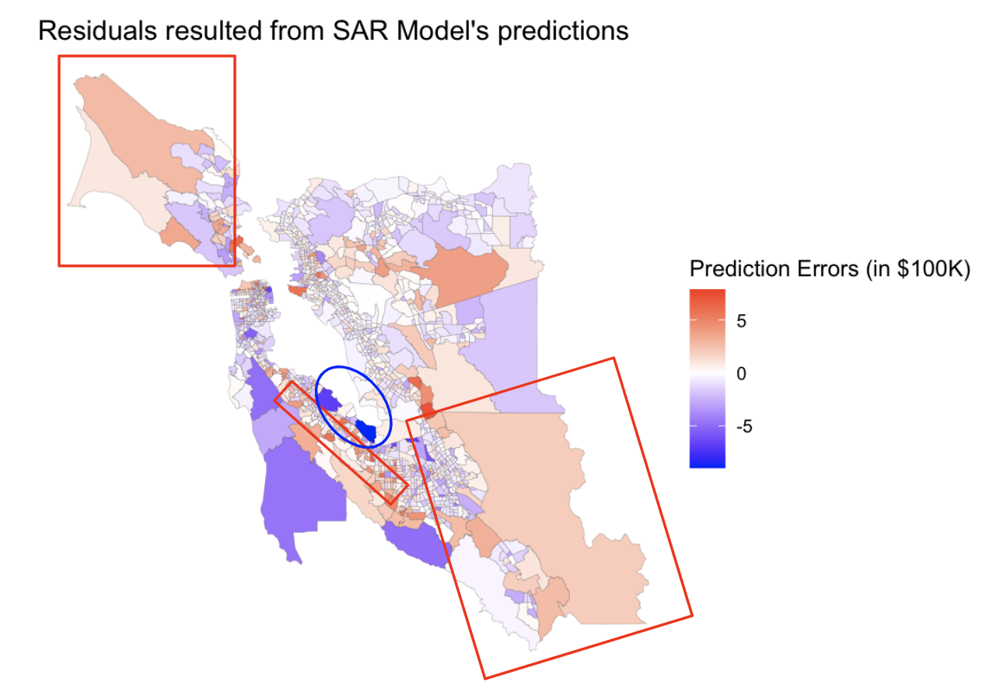

```{r setup, include=FALSE}
knitr::opts_chunk$set(echo = FALSE, message=FALSE, warnings=FALSE)
```

```{r}
library(dplyr)
library(lubridate)
library(stringr)
library(ggplot2)
library(sf) #install.packages('sf')
library(spdep) #install.packages('spdep')
library(patchwork)
library(viridis)
library(tidycensus)
library(tidygeocoder)
library(dplyr)
library(googlesheets4)
library(readr)
library(tidyr)
library(gganimate)
library(gifski)
library(transformr)
```

  
```{r, warning=FALSE}
# Load company data
sf_companies_long <- read_csv("sf_companies.csv")
```

```{r}
# Load bay area data from 2009 to 2019
load('CapstoneData.RData')
```

## An Introduction to the Evolution of Silicon Valley and Its House Values

Silicon Valley is the most established tech center in the world. Home to major technology conglomerates like Google, Apple, and Tesla, Silicon Valley is currently worth approximately $3 trillion. The area has evolved in a way that gradually lays the foundation for the booming tech industry. It started with various education and business opportunities related to electronics and electrical engineering. These business opportunities attracted companies from the semiconductor industry, which is essential to creating software, and the vision for the Internet. This made the area suitable for the rise of startups like Apple, Oracle, and Intel, which have become billion-dollar-worth household names and given way to the rise of the tech startup culture in the area. Although the dot-com bubble burst in 2000 scaled back the explosive overnight growth of the dot-com startups, it has allowed the tech industry to grow more sustainably than ever. The rise of companies like Google, Meta, and Amazon in this century has changed the way we live and think, which has resulted in increasing wealth in the area, reflected in the price of real estate [@OnePieceWork_2020].

The real estate market in the San Francisco Bay Area saw an uptick in price ever since the dot-com bubble. Despite being scaled back by the 2008 financial market crash, it has seen the greatest growth ever since [@Carlisle_2021]. In 2019, the median housing price in the Bay Area for a single-family home was $1.06 million [@Neilson_2021;@CAR_2021], which is 230% more expensive than the median house sales price in the whole United States by the end of 2019 [@FRED_2022].    

## Research question

**How do tech migration and other socioeconomic factors affect house values across census tracts in the Bay Area?**

We believe that the wealth in tech has spilled over to the real estate industry in the Bay Area. As two individuals interested in pursuing a tech career in emerging tech areas, i.e. Salt Lake City, Utah, or Austin, Texas, we wonder how the real estate scene there will evolve in the future, using the Bay Area as the point of reference. 

## An overall look at the house price in the Bay Area between 2009 and 2019 

Looking at the evolution of house prices in 6 Bay Area counties between 2009 and 2019, it is clear that the house prices increase over time, as indicated by the lighter color. Houses are more expensive in areas with a higher concentration of tech companies, such as counties in San Francisco, San Mateo, and Santa Clara, with the median house prices going from around `$750,000` in 2009 to over `$1M` in 2019. 


```{r}
# Animation

p1 <- bay_area_data_2009_2019_acs5_data %>%
  filter(!is.na(HouseValueE)) %>%
  ggplot() +
  geom_sf(aes(fill = HouseValueE, group=year), size = 0) +
  scale_fill_viridis_c() +
  scale_size(range = c(2, 12)) +
  labs(title = 'Year: {floor(frame_time)}', subtitle = 'Median House Prices across the Silicon Valley and Neighboring Areas') +
  theme_void() +
  transition_time(year)

animate(p1, duration = 20)

anim_save("house_price_animation.gif")
```

## Data Context

In this project, we worked with two types of data: Bay Area census data and tech company data. We intentionally narrowed the data down to between 2009 and 2019 to avoid any bias from the 2008 economic downturn recovery and outliers during COVID-19.  

**Bay Area census data**

The data is collected on each census tract from the American Community Service (ACS) run by the U.S. Census Bureau. These yearly estimates are an inference from data collected over 5-year intervals between 2009 and 2019 [@ACS_2022]. The data provides aggregate summaries of demographic information in census tracts of 6 Bay Area counties: San Francisco, San Mateo, Santa Clara, Alameda, Marin, and Contra Costa. Each census tract contains roughly 4000 inhabitants that are intended to be demographically and economically homogeneous. For the purpose of this analysis we used data on median estimated income, median population, median age, median household value, median household size, the median number of houses under tenure, the median proportion of people with different places of birth, the median proportion of different races, median proportion of different industries, median proportion of houses owned and rented, area, and segment. We create the segment variable to group different census tracts according to the aggregated growth of companies. 

**Tech company data**

We performed our analysis on the 13 companies with the largest market cap in the Bay Area [@Value_2022]. These companies are Apple, Google, Meta, Tesla, NVIDIA, Visa, Cisco, Broadcom, Adobe, Netflix, Salesforce, Oracle, and PayPal. Although Visa started out as a financial company, we included Visa in this list because its payment services are rooted in security technologies and the company has transformed into a financial technology (fintech) company with the evolution of technology [@VISA_2022]. 

We chose these 13 companies instead of all of the tech companies available in the Bay Area assuming the 80-20 rule applies in this case. We believe that the top 20% tech companies are those that contribute to 80% of the wealth in the Bay Area, and hence are more relevant to our analysis. We collected yearly data on the Earnings Before Interest, Tax, Depreciation, and Amortization (EBITDA) of these companies from 2009 to 2019, which aligns with the timeframe for the census data. We chose EBITDA as our growth indicator because it is a commonly used indicator for a company’s financial stability. We aggregated the EBITDA data of all companies within a 2000 meters radius of distance from a specific census tract to create a proxy for technology-related economic activity [@Investopedia_2022]. We obtained the tech company data from the Macrotrends website [@Macrotrends_2022].

Through longitudinal and spatial data analysis, we hoped to gain insight into how the tech industry and the rise of tech hubs can affect housing value.


## Our analysis approach: Longitudinal and Spatial Analysis

We chose a longitudinal model because we wanted to observe and explain the changes in house values resulting from the rise of tech companies and other socioeconomic factors in the long run. A longitudinal model allows us to consider various factors that may affect the outcome over time. It also provides the correlation between them, enabling us to determine which factors are essential in explaining house values. We believe that, while there are factors related to tech migration that might lead to short-term house price increases, there is a delay in time between the migration of tech companies and the changes in house value. Therefore, a longitudinal analysis allows us to incorporate time into our analysis. Additionally, we were able to observe and compare changes across multiple observation units, which are the census tracts in this case.
 
In addition to accounting for the time aspect, we also wanted to take into consideration how the house prices in a census tract are impacted by those in the neighboring census tracts. Therefore, we used techniques related to spatial data to perform that analysis.


## Longitudinal Analysis

In our longitudinal analysis, we hoped to explain the changes in Bay Area house prices through the tech migration and other socioeconomic factors over time. The delayed effect of tech companies’ growth on house prices can be explained by macroeconomic dynamics. In this case, we believe that there has been a boost in demand for housing due to the expanding labor market caused by the growth of tech companies in the area. This increase in demand is expected to cause an increase in house values when the supply gradually becomes insufficient. 

We hypothesize that there are different degrees of growth for tech companies, and the census tracts with higher growth companies will see more drastic increases in house prices. In order to fulfill our research question, we set out to segment the census tracts into different groups and look that them in relation to different socioeconomic indicators to see how they impact house prices. 


### Data Processing

To prepare the data for our analysis, we combined the two datasets, i.e. tech company data and the Bay Area data, into one big dataset using their longitude and latitude information. The Bay Area data already has spatial information, with longitudinal and latitude, while the company data does not. We tackled this by using the geocode package to obtain the longitudinal and latitude information of the companies based on their addresses. Specifically, geocode takes the companies' addresses and adds the corresponding longitude and latitude to the existing table. After that, we transformed the coordinate system of the company data to match that of the Bay Area dataset as these two datasets have different types of coordinate systems. This way, we confirmed we could combine the data. Next, we aggregate the data by matching each company with the census tracts located within its 2000 meters radius. We then computed the overall EBITDA growth percentage in the census tracts that are in the 2000-meter proximity to the tech companies between 2009 and 2019. 

We separated the census tracts into four different groups based on their yearly EBITDA growth and used different resources to determine the cut-off points [@Geckoboard_2022;@BalboaCapital_2022]. Census tracts that have yearly EBITDA growth greater than 50% are the "High Growth" tracts. "Medium Growth" tracts have EBITDA growth ranging from 20% to 50%, and the figure for "Low Growth" tracts is under 20%. Census tracts that are not within 2000 meters radius of tech companies belong to the "Control" group. For the rest of our paper, we’ll refer to these different growth groups with the understanding that these growth groups are defined by the EBITDA growth of tech companies.   


```{r}
# Filter years before 2020

sf_companies_long <- sf_companies_long %>%
  filter(year < 2020) # keep data from 2009 to 2019
```

```{r, message=FALSE}
sf_companies_with_coordinates <- sf_companies_long %>%
  geocode(Address)
```

```{r}
## Use coordinates to match geographic shape and check for coordinate system to match Bay Area's

sf_companies_reshape <- st_as_sf(sf_companies_with_coordinates, coords = c("long", "lat"))
st_crs(sf_companies_reshape) = st_crs(bay_area_data_2009_2019_acs5_data)

## Calculating growth for companies by EBITDA
sf_companies_growth <- sf_companies_reshape %>%
   group_by(Name, Address) %>%
   mutate(PreviousYearEBITDA = lag(Yearly_EBITDA_million, n = 1, default = NA)) %>% 
   ungroup()
```

```{r}
tract_dataset <- bay_area_data_2009_2019_acs5_data %>% filter(year == 2019) %>% select(GEOID, geometry)
```

```{r}
## Find total change % in EBITDA per census tract
### Join the companies and the census tracts that lie within the companies' 2000m radius

tract_data_with_company_name <- st_join(tract_dataset, st_buffer(sf_companies_growth, dist=2000))

## Only keep the census tracts that have any intersection with the companies

tract_dataset_with_company_info <- tract_data_with_company_name %>% 
  group_by(GEOID, year) %>% 
  summarize(aggregate_EBITDA = sum(Yearly_EBITDA_million, na.rm=TRUE),
            aggregate_past_EBITDA = sum(PreviousYearEBITDA, na.rm=TRUE),
            EBITDA_growth = ((aggregate_EBITDA-aggregate_past_EBITDA)/aggregate_past_EBITDA)) %>% 
  ungroup() %>% 
  filter(!is.na(year))


## This line of code is changing the value for meanEPS when it has no input (from NaN to NA), weird, it gives 2009 EBITDA lagged values 

tract_dataset_with_company_info$EBITDA_growth[is.nan(tract_dataset_with_company_info$EBITDA_growth)] = NA
tract_dataset_with_company_info$EBITDA_growth[is.infinite(tract_dataset_with_company_info$EBITDA_growth)] = NA
tract_dataset_with_company_info$EBITDA_growth[is.na(tract_dataset_with_company_info$EBITDA_growth)] = 0

tract_dataset_with_company_info$year = as.numeric(tract_dataset_with_company_info$year)

```

```{r}
## Assigning growth rate with growth segment

tract_dataset_with_company_info <- tract_dataset_with_company_info  %>%
  mutate(segment = case_when(
  EBITDA_growth >= 0.5 ~ "High Growth",
  EBITDA_growth >= 0.2 & EBITDA_growth < 0.5 ~ "Medium Growth",
  EBITDA_growth > 0 & EBITDA_growth < 0.2 ~ "Low Growth",
  EBITDA_growth <= 0 ~ "Low Growth",
  TRUE ~ as.character(EBITDA_growth)
))

## Create a distinct list of segment corresponding to which GEOID and year to merge with the larger data
county_growth_assignment <- tract_dataset_with_company_info %>% 
  select(GEOID, segment, year) %>% 
  distinct() %>%
  arrange(GEOID) %>% 
  st_drop_geometry()


longitudinal_data <- left_join(bay_area_data_2009_2019_acs5_data, county_growth_assignment, by = c("GEOID","year"))

longitudinal_data$county <- strsplit(longitudinal_data$NAME, ',') %>% sapply(.,function(v) trimws(v[2]))

longitudinal_data$segment[is.na(longitudinal_data$segment)] = "Control"

```


```{r, message=FALSE}
# Visualization for overall plot pre-GEE (have to include)

average_median_housing_value <- longitudinal_data %>% 
  st_drop_geometry() %>%
  group_by(year, segment) %>% 
  summarise(avg_median_house_value = mean(HouseValueE/100000, na.rm = TRUE))
  
average_median_housing_value %>%
  ggplot(aes(x=year, y=avg_median_house_value, color = segment)) + 
  geom_line() + 
  geom_vline(aes(xintercept = 2014), linetype = "dotted", color = "black", size = 0.5)+
  theme_classic()+
  labs(title= "Median House Price for Different Growth Segments between 2009 and 2019", x = "Year", y = "Median House Price (in $100K)", color = "Growth Segment")+
  scale_color_viridis_d(alpha = 1)
```

From this graph, we can see that the house prices across the 4 growth segments follow the same trend. However, after 2014, there are some drastic changes. The line representing the median house price in high growth areas is steepest, followed by medium growth and high growth. This potentially reflects the fact that the high growth of tech companies had a larger effect on house values. High-growth, medium-growth, and low-growth groups have higher house prices than the control group, which is consistent with our prior beliefs that the presence of tech companies correlates with house values. The fact that areas with low tech growth present higher prices for years between 2013 and 2017 could be caused by different factors like increases in the supply of houses in medium and high growth areas. Also, during that time, there were probably many emerging startups, which required more space for offices within the Silicon Valley, which potentially generated house shortages and boosted the price. 

### Variable consideration for the model

After conducting an analysis of the correlation between the different potential factors and Bay Area median house prices, the factors that present strong correlations with the outcome are income, age, household size, the proportion of people whose birthplace was in a state, the proportion of people in the information industry, finance, professional, and other industries. The proportion of white and black populations also had a considerable correlation with median house value. As the analysis focuses more on causal inference than prediction, we won’t omit any confounding variables. It is important to mention that we are including independent variables that are moderately correlated with each other. 

We also include county information in the data to control for the effect on housing. The reason is that census tracts that are in the same county tend to have similar house prices, which makes county a reasonable indicator. We hypothesize that, due to the spillover effect from the thriving tech companies, counties with higher EBITDA growth will have a larger house value compared to those with lower EBITDA growth. Additionally, higher incomes and population growth increase the demand for housing as people can afford larger mortgages and there is a higher demand for housing [@Pettinger_2021]. 


```{r}
correlation_chart <- longitudinal_data %>% 
  select(HouseValueE, IncomeE, PopE, AgeE, HouseholdSizeE, NumHouseE, `BirthPlace_Foreign born:`, `BirthPlace_Born in state of res`, Industry_Whole, Industry_Infor, Industry_Finan, Industry_Profe, Industry_Other,`Race_White alone`, `Race_Black or African American`, AREA) %>% 
  st_drop_geometry() %>% 
  cor(.,use='complete.obs')
```


```{r}
# median_house_value_by_county <- longitudinal_data %>% group_by(county, year) %>% summarise(med_house_price = median(HouseValueE, na.rm = TRUE))
```

### Generalized Estimating Equation (GEE) Model

We chose GEE because it allows us to work with different correlation structures. In other words, we are able to test different assumptions regarding the correlation magnitude in our longitudinal data. Another option is a mixed-effects model, which we consider quite simplistic due to its assumption of exchangeable correlation. In other words, it is unrealistic to assume that longitudinal data has a constant correlation independent of the difference in years. 

Furthermore, we consider that using GEE is advantageous as it has Robust Standard Errors (SE), which is independent of the working correlation structure and is close to the real SE. This allowed us to compare the Model SE to the Robust SE when evaluating and choosing the best model. 

Correlation structure is a crucial component of the GEE model. When we set out to model the median house value, we were concerned about finding an appropriate correlation structure for the data we have. A correlation structure indicates our assumption for the magnitude at which the data correlate over time. 

Therefore, we created different models to test different correlation structures and variables potentially impacting house values. In the first model, we used the exchangeable correlation structure, which assumes that the correlation between different EBITDA growth groups is constant and that the correlation for each EBITDA group does not change over the years. We don't think that this assumption is realistic in the context of our analysis. In fact, we believe that the correlation among the observations varies across the years. Specifically, given the effects of the 2008 economic crisis on the housing market, we would expect house values between the years 2009 and 2010 to be more similar than those between 2009 and 2018. 

In our final model, we used a correlation structure that shows an exponential decay to 0 with time in the correlation of observations. This correlation structure is known as an Autoregression Model of order 1 (AR1). We also chose the set of variables that would shed light on the changes in house prices. We transformed some of the variables to make them more concise. For our outcome variable, we decided to divide the median house values by 100,000 to decrease the magnitude of the data and make computations easier. Similarly, we also reduced the magnitude of the income variable by 10,000. We included the indicators for household size, income, the proportion of people born in California, the proportion of white people, and county variables. With this set of variables, we aimed to explain how tech growth and socioeconomic changes impact house values. 

We carry out a hypothesis test on the estimated coefficients in the GEE model to see whether there is a powerful relationship between the chosen factors and house values over the years. We conclude that the factors contribute significantly to explaining house values, indicated with a p-value lower than 0.05. Specifically, there is in fact a 0% chance that we would observe the data as we have if there was no correlation at all between the variables and the house value outcome.


```{r, results='hide'}
# install.packages('geeM')
library(geeM)

# GEE model

gee_mod <- longitudinal_data %>%
  st_drop_geometry() %>%
  drop_na(HouseValueE, year, segment, HouseholdSizeE, IncomeE, `BirthPlace_Born in state of res`, `Race_White alone`, county) %>%
  mutate(outcome = HouseValueE/100000, 
         IncomeE = IncomeE/10000) %>% # in hundreds of thousands
  geem(outcome ~ year*I(year > 2014)*segment + HouseholdSizeE + IncomeE + `BirthPlace_Born in state of res`+ `Race_White alone`+ county, data = ., id = GEOID, corstr = 'ar1') # AR1 working correlation 

gee_mod %>% summary()

```

```{r, results='hide'}
b = gee_mod$beta
length(b)
W = gee_mod$var


(L = matrix(c(rep(0,15), 1, rep(0,9),
              rep(0,16), 1, rep(0,8),
              rep(0,17), 1, rep(0,7),
              rep(0,18), 1, rep(0,6),
              rep(0,19), 1, rep(0,5),
              rep(0,20), 1, rep(0,4),
              rep(0,21), 1, rep(0,3),
              rep(0,22), 1, rep(0,2),
              rep(0,23), 1, rep(0,1),
              rep(0,24), 1, rep(0,0)), nrow=10,byrow = TRUE)) #L for Lb

## Hypothesis Testing
w2 <- as.numeric( t(L%*%b) %*% solve(L %*% W %*% t(L))%*% (L%*%b)) ## should be approximately chi squared
1 - pchisq(w2, df = nrow(L)) #p-value
```


```{r, results='hide', fig.show='hide'}
spatial_data_no_empty_geo_2018 <- longitudinal_data %>% 
  drop_na(HouseValueE, year, segment, HouseholdSizeE, IncomeE, `BirthPlace_Born in state of res`, `Race_White alone`, county) %>%
  mutate(predicted = predict(gee_mod), residual = HouseValueE/100000 - predicted) %>% 
  filter(year == 2018) %>% 
  filter(!st_is_empty(.)) 

bay_area_centroids <- st_centroid(st_geometry(spatial_data_no_empty_geo_2018), of_largest_polygon = TRUE)


KNN <- knn2nb(knearneigh(bay_area_centroids, k = 3)) #Trying

nb_KNN_net <- nb2lines(nb = KNN, coords = bay_area_centroids, as_sf = TRUE)

Wb <- nb2listw(KNN, style = "B")

spdep::moran.test(spatial_data_no_empty_geo_2018$residual, Wb, alternative = "two.sided", randomisation = TRUE)

#there is significant evidence to reject the null hypothesis that the residuals are independent and identically distributed


mp <- spdep::moran.plot(spatial_data_no_empty_geo_2018$residual, Wb, plot=FALSE)
ggplot(mp, aes(x = x, y = wx)) + 
  geom_point() + 
  geom_smooth(method="lm" , se = FALSE) + 
  geom_hline(yintercept=mean(mp$wx), lty=2) + 
  geom_vline(xintercept=mean(mp$x), lty=2) + theme_classic() + 
  xlab('Residuals') + ylab("Average Residual of Neighbors")+
  ggtitle("Correlation of Residuals")

```


### Evaluating the GEE model through its residual plot

A residual plot shows whether the model underpredicts or overpredicts house prices in different areas of the Bay Area. While white color shows that the actual house prices are similar to the model predictions, red indicates areas that have higher actual house prices, and blue shows areas with lower actual house prices than the model predictions. Looking at the residual plot, we can see that the actual house values in the census tracts around the Silicon Valley are much higher than what the GEE model predicts. On the other hand, houses in bigger census tracts have much lower values than the model estimates. From these results, we believe that there is some degree of spatial correlation that cannot be accounted for by a longitudinal model. In other words, the GEE model does not take into account how the median house price in a certain census tract can be influenced by the prices in the neighboring census tracts. 


```{r}
#Map residuals

longitudinal_data %>% 
  drop_na(HouseValueE, year, segment, HouseholdSizeE, IncomeE, `BirthPlace_Born in state of res`, `Race_White alone`, county) %>%
  mutate(predicted = predict(gee_mod), residual = HouseValueE/100000 - predicted) %>% 
  filter(year == 2018) %>%
  ggplot() +
  geom_sf(aes(fill = residual),size=0)+
  scale_fill_gradient2(mid = "white",
    high = "red", low = "blue") + 
  labs(title = "Residuals resulted from GEE Model's predictions", fill = "Prediction Errors (in $100K)") +
  theme_void()
```


In order to verify this spatial relationship between the residuals after predicting using the GEE model, we conduct the Moran’s I test. We found that the residuals are spatially correlated, indicated by the p-value smaller than 0.05 in the test (p-value = $2.2 {*} 10^{-16}$). In other words, there is almost a 0% chance that we would observe the actual median house prices like in the data if the residuals were not spatially correlated. 

Therefore, we decide to create a spatial model to account for the spatial correlation that is unexplained by the GEE longitudinal model. 


## Spatial Analysis

### Introduction to Neighborhood Structure

Census tracts that are closer to one another might have similar house prices. For example, census tracts that are in counties closer to tech companies like San Mateo and Santa Clara will be more similar compared to those in Marin which is much further from the tech hub. Therefore, it is important to statistically identify groups of census tracts that are closer, or are “neighbors”, to the others. In order to identify groups of neighbors, we use a concept called neighborhood structure, which helps us establish how close the census tracts are to one another. There are many techniques to define neighborhood structure, but here we used a method called K Nearest Neighbors (KNN), which calculates the distance among the centers of the census tracts and groups the census tracts into different groups of k neighbors. 

We chose the KNN neighborhood structure as we want to restrict the number of neighbors in each group. We believe that this method is valuable in the sense that it creates groups of neighboring census tracts, each with k neighbors, and hence contributes to the generalization ability of the model. We choose 3 as the number of neighbors each census tract can have as it helps prevent the very congested network for the counties closer to the city. In other words, it helps eliminate the problem of census tracts having too few or too many neighbors.


### Spatial Autoregressive (SAR) Model 

We use Spatial Autoregressive Models (SAR) to model the spatial correlation for the leftover residual from the linear regression model. The SAR model reflects a stronger pattern of spatial covariance than CAR (when using the same parameter and weights), and it decays slower than the CAR model. The SAR model is also better than the CAR model, as indicated by the BIC indices of the SAR and CAR fitted models. The BIC index is the goodness-of-fit measure, and it shows how well the model fits the data.

From the longitudinal analysis, we know that there are tech growth and socioeconomic factors affecting house values over time. Our goal for spatial analysis is to account for spatial correlation in a specific year. As spatial techniques cannot be conducted on data spanning different time periods, we choose to perform spatial analysis on 2018 data only. 

After using SAR to model the data, we ran the Moran’s I test again and found that the leftover errors after SAR are independent. In other words, the SAR model has captured the possible spatial correlation, as indicated by the Moran’s I statistics, which is nearly 0, and the p-value greater than 0.05 (p-value = 0.1489). Therefore, not only there is a longitudinal effect on house prices over the years in Bay Area census tracts but there is also a spatial correlation in each year, as we have seen for 2018.


### Evaluating the SAR model through its residual plot

The residual plot for the SAR model shows that there are some counties whose house values are underestimated or overestimated by the model, indicated by the darker red and blue colors. Specifically, we can see very large residuals in the San Mateo and Santa Clara counties as well as larger counties on the leftmost and rightmost sides of the map. 

We carry out further exploration of the area using Google Maps and discover some terrain characteristics that can explain the high magnitude of difference in the residuals. For example, there are two areas whose residuals are still high even after the GEE and SAR models that are located along the inner coast of San Mateo County, as indicated by the deep blue color. The large residuals turn out to be reasonable as these two areas are not residential areas. In other words, one of them is Foster City, which is an industrial area, and the other area is the home of national parks. The houses in these areas might be undesirable due to their proximity to industrial/manufacturing areas or pure nature reserves and no business or recreational endeavors. In addition, the orange-color census tracts on the top left corner and lower right corner of the map show a different trend. Using Google Maps, we can see that these two areas are the home of several national and local parks. As the orange color indicates that the actual house values in these areas are higher than SAR predictions, there might be luxury resorts or private holiday properties that might spike the house prices. For houses around the Silicon Valley area that are also of an orange shade, the higher actual prices can be explained by higher demand given that it is close to big tech companies with high wealth and large labor forces. This makes the area appealing to not only workers but also other big tech companies, emerging tech startups, and venture capital funds. 


```{r, results='hide', fig.show='hide'}
# Spatial Analysis

spatial_data <- longitudinal_data %>% 
  filter(year == 2018)

spatial_data_no_empty_geo <- spatial_data %>%
  filter(!st_is_empty(.)) 

spatial_data_no_empty_geo <- spatial_data_no_empty_geo %>%
  drop_na(HouseValueE, year, segment, HouseholdSizeE, IncomeE, `BirthPlace_Born in state of res`, `Race_White alone`, county) %>% 
  mutate(outcome = HouseValueE/100000, IncomeE = IncomeE/10000) %>% #in hundreds of thousands
  st_as_sf()

# Fit SAR Model
library(spatialreg) #install.packages('spatialreg')

bay_area_centroids <- st_centroid(st_geometry(spatial_data_no_empty_geo), of_largest_polygon = TRUE)

KNN <- knn2nb(knearneigh(bay_area_centroids, k = 3)) #Trying

Ww <- nb2listw(KNN, style = "W")

mod_sar <- spatialreg::spautolm(formula = outcome ~ segment + HouseholdSizeE + IncomeE + `BirthPlace_Born in state of res`+ `Race_White alone`+ county, data = spatial_data_no_empty_geo, listw = Ww, family = "SAR")

summary(mod_sar)

spatial_data_no_empty_geo$sar_resid <- resid(mod_sar)

spatial_data_no_empty_geo%>% ggplot() +
  geom_sf(aes(fill = sar_resid),size=.05) +
  scale_fill_gradient2(mid = "white", high = "red", low = "blue") + 
  labs(title = "Residuals resulted from SAR Model's predictions", fill = "Prediction Errors (in $100K)") +
  theme_void()

Wb <- nb2listw(KNN, style = "B")

spdep::moran.test(spatial_data_no_empty_geo$sar_resid, Wb, alternative = "two.sided", randomisation = TRUE)  # Using randomization test

```

```{r pressure, echo=FALSE, out.width = '100%'}

```


## Results and Discussion

In our analysis, we found evidence suggesting that house values grow differently for different growth segments post-2014. Especially for the high growth segment, the increase in the house prices outweighs the increase in the medium and low growth groups as well as control areas. Such drastic changes can be the result of the market recovery post-2018 economic downturn as well as the technology innovations and growth happening in the area [@Carlisle_2021]. This is consistent with our hypothesis that higher company growth is associated with higher house values. Aside from the longitudinal effect of tech growth and other socioeconomic factors on Bay Area house prices over the years, there is also a spatial correlation in each year, meaning that house prices in neighboring areas of a census tract can inform the house price of that area. 

In addition, income and whether the census tract has a majority white population are positively correlated with higher house values. Perhaps this is because higher income allows people to afford more expensive houses. Also, the higher the proportion of white residents in a census tract, the higher house values are likely to be. This could be due to the effect of redlining, where people of color have been historically discriminated against in the housing market. 

On the other hand, the median household size in a census tract and whether there is a high proportion of people born in California negatively correlate with house prices. Such a trend in household size can be explained in terms of race and age. White households are usually smaller in size, while people of color households tend to be bigger due to living with extended families or having more children. Also, immigrants are more likely to live with extended families who immigrate with them. Regarding the negative effects of the proportion of Californian residents, that can be explained by foreign money. If there is a higher proportion of people from outside of California coming to the area, there will be more wealth flowing into the area, potentially through tech investments from other states or countries.   

Finally, the house prices of nearby census tracts impact one another. We can see that Silicon Valley and the neighboring census tracts experience relatively similar house values. Other residential census tracts that are further away or in a county that is not affiliated with big techs like Marin or Contra Costa experience much lower house prices.    

Moving forward, there are many directions we can take to improve the analysis. Firstly, we can consider using Uber data to determine the distance between different census tracts and tech companies in terms of minutes. As we hypothesize that house prices are in high demand as high-income tech employees want to live closer to their companies, this can allow us to identify which areas can be desirable for tech employees. Secondly, natural terrain can be a factor in determining house prices. As we have mentioned, areas with national parks or right beside mountains might have cheaper houses; therefore, incorporating natural geographic data into the analysis can improve our models. Thirdly, we hope to combine our longitudinal and spatial models into one as we potentially have to write a new library for the joined model. Finally, we would like to control for interest rates, considering that lower interest rates could lead to higher demand for housing due to better mortgage deals. 

Additionally, as our ultimate goal is to understand the house prices in emerging tech hubs like Austin, Texas, and Salt Lake City, Utah, we want to obtain similar data in these areas to verify the insights in this analysis and potentially make a predictive model for these areas. 

One limitation to our census data is that there is a ceiling, or maximum, value for house prices. Before 2014, the house value is capped at `$1M`, whereas the cap is `$2M` after 2014. There might have been some wording changes on the census survey, which affects the Bay Area census data.   


## Acknowledgements

We would love to thank our amazing Prof. Brianna Heggeseth for her guidance and inspiration for this project. We love you, Brianna!

## References


