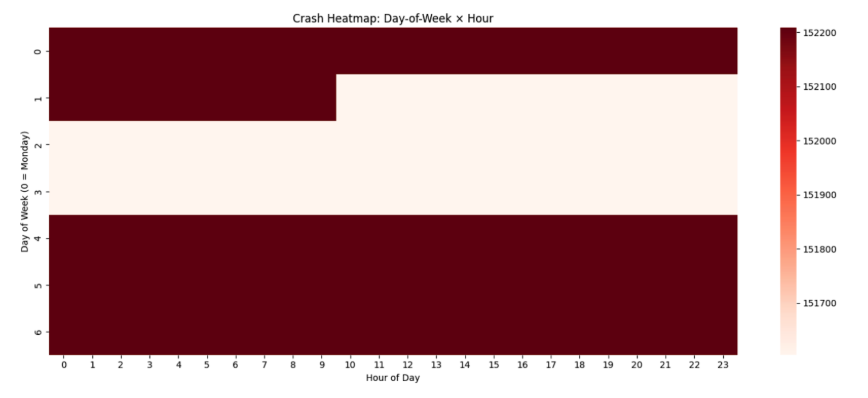
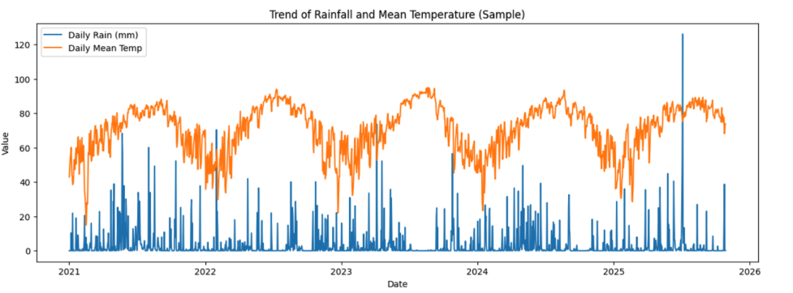
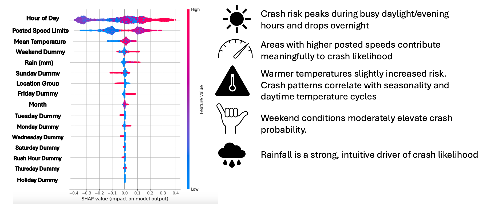
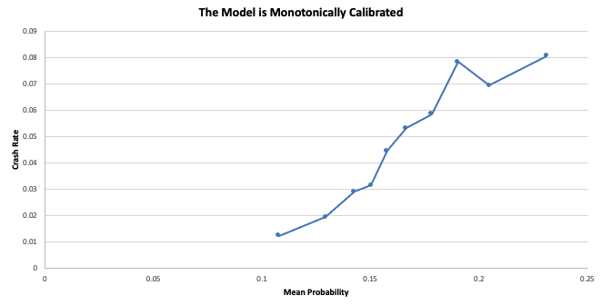

```{r setup, include=FALSE}
knitr::opts_chunk$set(echo = FALSE)
```

# ABSTRACT

Traffic crashes in Austin impose substantial human, social, and financial costs. Recent statewide statistics highlight the severity of the problem, with fatalities, injuries, and reportable crashes occurring at frequent intervals and an estimated annual burden of more than thirty five million dollars to Austin taxpayers. These losses underscore the need for proactive, data-driven safety strategies. This project addresses that need by developing a spatiotemporal crash-risk prediction system that transforms raw crash records into a structured modeling framework using H3 hexagonal spatial indexing and one hour temporal aggregation. The dataset is further enriched with engineered temporal features such as lagged counts, rolling statistics, and recency indicators, along with environmental attributes including rainfall and temperature sourced from the Open Meteo API. Exploratory analysis reveals pronounced spatial clustering along major transportation corridors and clear temporal cycles shaped by commuting patterns, weather conditions, and weekend activity.

Building on this foundation, the project implements three complementary machine learning approaches: a Binary LightGBM classifier to estimate crash occurrence, a Tweedie XGBoost model to explore severity-related patterns, and a two stage Hurdle Model that separates crash likelihood from conditional count estimation. Together, these methods inform a spatiotemporal risk surfaces that capture the probability and relative intensity of crash events across the city. While precise severity prediction remains challenging due to heavy-tailed cost distributions and missing post-crash variables, the models successfully uncover meaningful associations between environmental and temporal factors and crash risk. The resulting system provides interpretable, operationally useful insights that can support city planning, EMS deployment, insurance pricing, and transportation safety decision-making.


# 1. Introduction & Background:
## 1.1. Why Austin Crash Prediction Matters:

Austin is one of the fastest growing cities in the United States, with rising traffic volume, ongoing construction, and increasing mobility needs. As the city expands, crashes remain a persistent challenge, leading to injuries and fatalities, causing congestion and lost travel time, generating millions of dollars in economic losses, and placing significant stress on EMS, fire, and police resources. Predictive crash modeling directly supports smarter city operations by enabling more efficient patrol deployment, guiding strategic EMS staging, informing infrastructure investment decisions, advancing insurance and risk pricing innovation, and improving navigation safety for rideshare and freight systems. A spatiotemporal crash prediction system ultimately allows city agencies to shift from reactive responses to proactive data driven safety management.

The societal and financial burden of crashes is substantial, encompassing direct medical and emergency response costs, property damage and insurance payouts, reductions in workforce productivity, congestion and broader travel impacts, and long term disability related expenses that ripple through communities. Given the scale of this harm, even modest improvements in crash prediction can generate meaningful benefits. By identifying high risk locations and times, cities can implement targeted and cost effective interventions that improve safety and reduce overall system strain.

## 1.2 Related Work: Spatial–Temporal Crash Forecasting:

Research consistently shows that crash risk exhibits clear structure across space and time. It is often spatially clustered, particularly along high speed corridors and major road segments. It is also temporally autocorrelated, with strong rush hour, day of week, and seasonal cycles. Crash likelihood further depends on weather, roadway design, visibility, and pavement and surface conditions, and it can propagate across nearby locations, which has motivated the use of spatial and network aware modeling frameworks. Prior literature has applied a variety of methods, including Poisson and Negative Binomial regression, tree based ensemble models such as Random Forests, XGBoost, and LightGBM, H3 based geospatial grids for consistent spatial aggregation, and graph oriented models for network level representation.

Our project builds on this foundation by constructing a unified H3 by hourly panel that captures consistent patterns across space and time, engineering a rich set of temporal features including lag variables, rolling windows, and recency indicators, and incorporating weather driven fluctuations in crash risk. This structured dataset supports the implementation of our three modeling approaches: a Tweedie XGBoost model for severity related outcomes, a Binary LightGBM model for crash occurrence, and a two stage Hurdle Model that links classification and severity estimation in a coherent framework.

## 1.3 High-Level Overview of Our Two-Approach System (Conceptual):

Our modeling framework combines complementary methods to estimate both the probability of a crash and the relative severity patterns across Austin.

### Approach A: Light Gradient Boosting Machine:

The LightGBM model predicts the probability of a crash at each hex cell and hour. It uses lagged crash counts, rolling statistics, weather variables, roadway context, and temporal indicators to identify when and where risk increases. This approach is well suited for structured tabular data and forms the core of our crash occurrence prediction.

### Approach B: Tweedie XGBoost:

The Tweedie XGBoost model explores patterns in crash cost severity. Because severity data is non-negative and heavily skewed, the Tweedie loss captures broad tendencies rather than exact dollar values. The model highlights which environmental and temporal conditions align with historically higher severity outcomes, making it valuable for exploratory insight.

### Approach C: Hurdle Model:

The Hurdle Model links occurrence and count prediction in a two stage structure. Stage one uses a LightGBM classifier to estimate the probability of a crash. Stage two uses a LightGBM Poisson model trained only on crash events to estimate expected count given occurrence. Since crash counts are extremely rare, the main predictive value comes from the first stage, which effectively ranks high risk times and locations.

Together, these approaches inform spatiotemporal risk surfaces that reflect both crash probability and severity tendencies across the city.

## 1.4. What’s Novel in Our Project:

Our system design incorporates several choices that strengthen the quality and interpretability of the modeling process. The use of H3 hexagons provides a consistent spatial framework that reduces bias and supports future graph based modeling extensions. An hourly temporal resolution offers a practical balance between data sparsity and meaningful signal. We develop a comprehensive feature engineering framework that includes lag variables, rolling statistics, recency measures, and detailed weather inputs. The dataset we built also includes a full spatiotemporal expansion, ensuring that locations and hours with zero crashes are explicitly represented so the models learn both presence and absence of events. Throughout the workflow, we emphasize interpretability and operational value so that the results can directly inform policy and safety focused decision making.

# 2. Data Description:

## 2.1 Crash Dataset Overview:

The Austin Crash Report Dataset, sourced from the City of Austin Open Data Portal, contains detailed crash level records of traffic incidents across the city, with each record representing a unique event characterized by forty seven distinct attributes covering temporal, spatial, contextual, and outcome related details. These attributes include the event timestamp, latitude and longitude, crash severity and estimated cost, lighting conditions, surface conditions, weather descriptors, counts of vehicles and persons involved, and roadway type and contributing factors. Updated on a daily basis and currently containing more than two hundred twenty thousand crash records, this dataset provides extensive coverage across multiple years and offers a rich foundation for feature engineering and for building a comprehensive spatiotemporal modeling framework.

Dataset Source: City of Austin Open Data Portal – Austin Crash Report Data: Crash Level Records.
https://data.austintexas.gov/Transportation-and-Mobility/Austin-Crash-Report-Data-Crash-Level-Records/y2wy-tgr5

## 2.2. Size & Time Span:

The dataset contains more than two hundred twenty thousand crash records and is updated on a daily basis, providing a continuously refreshed view of roadway conditions in Austin. It spans multiple years, which enables strong temporal analysis through the use of lag features and rolling windows. The high level of temporal granularity also supports modeling at an hourly prediction resolution, allowing the system to capture short term fluctuations in crash risk.

## 2.3. Data Cleaning and Validation:

The raw dataset contained approximately two hundred twenty four thousand crash records across forty seven attributes. We removed empty or non-informative fields, filtered out records with invalid coordinates by restricting the data to Austin’s geographic bounds, and standardized timestamps to the America Chicago timezone. The estimated cost field was cleaned and converted from text to a numeric format, and duplicate crash identifiers were removed. After validation, approximately two hundred twenty thousand high quality records remained with complete and consistent values for key fields such as crash identifier, timestamp, latitude, and longitude. This cleaned dataset provides a reliable foundation for spatio temporal aggregation and modeling.

## 2.4 Spatial Representation Using H3 Hexagonal Indexing:

H3 is a hexagonal spatial indexing system that provides uniform cell shapes, which eliminates directional bias that can arise with square grids. It supports efficient neighbor queries, making it useful for graph based spatial analysis, and it scales naturally across multiple resolutions. These properties make it well suited for city scale machine learning tasks. In our project we use resolution eight, which produces cells roughly two hundred to three hundred meters across, an appropriate level of spatial detail for modeling urban crash patterns.

## 2.5  Rationale for One Hour Temporal Resolution:

Hourly time bins offer a practical balance between signal strength and data sparsity. This resolution captures rush hour dynamics, aligns well with EMS call cycles, reflects short term weather fluctuations, and avoids the extreme sparsity that occurs with fifteen or thirty minute intervals. At the same time, it preserves short term temporal variation that is lost in daily aggregates. The broader risk forecasting literature also supports hourly resolution for urban safety modeling, making it a natural choice for this project.

## 2.6 Inclusion of Negative Instances Through Hex Time Expansion:

To avoid a dataset that only represents times and locations where crashes occurred, we construct a complete hex by hour grid for the entire study period. Every H3 cell and every hour is included, with a crash count of zero assigned when no crash occurred. This transformation produces a true spatio-temporal panel that allows the models to learn from both high risk and low risk situations. It is essential for proper rare event classification and for Poisson-based or Tweedie-based severity modeling, and it prevents the biased learning that arises in naïve crash modeling pipelines that omit negative observations.

# 3. Exploratory Data Analysis (EDA):

Our EDA examines temporal patterns, spatial distribution, and environmental influences.

## 3.1 Temporal Patterns:

Exploratory analysis of the time series reveals clear morning and evening peaks that align with daily commute windows. Crash activity increases during weekend nighttime hours, particularly in entertainment districts, while early morning periods consistently show the lowest crash incidence. Monthly and seasonal cycles also emerge, influenced by temperature changes, daylight variation, and mobility demand. These patterns confirm the importance of using detailed temporal features in the modeling pipeline.

{width=70%}

## 3.2 Spatial Patterns:

Spatial visualization using H3 density maps shows strong clustering of crashes along major transportation corridors such as Interstate 35, MoPac, and US 183. Additional high risk concentrations appear in downtown Austin and in well known nightlife areas including Rainey Street and West Sixth Street. The presence of these consistent spatial clusters reinforces the decision to represent the city using a hexagon based spatial index, which captures localized variations in crash risk.

{width=60%}

{width=70%}

## 3.3 Weather Effects:

Weather aligned patterns in crash activity reveal noticeable spikes during periods of rainfall, as well as during hours with low visibility or cloud cover. Hot summer months also show elevated crash frequencies, driven in part by increased mobility and congestion. These observed relationships highlight the important role of environmental conditions and support the integration of rainfall and temperature features in the modeling framework.

Although most crashes occur in dry conditions simply because dry hours are far more common, rainfall remains an important predictor because it substantially increases relative crash risk whenever it occurs. Rain is a low-frequency but high-impact feature: crashes are less frequent in absolute terms during rain, yet the probability of a crash rises sharply compared with dry conditions. The model captures this elevated conditional risk, which is why rainfall appears as a strong feature in both SHAP values and importance rankings.

{width=80%}

{width=70%}

## 3.4 Correlations & Feature Interactions:
Correlation analysis shows strong dependencies among lag and rolling window features, reflecting the persistence and clustering of crash activity over short horizons. Moderate interactions appear between weather variables and temporal indicators, such as temperature and hour of day, while raw spatial features exhibit low correlation with hourly temporal bins. These relationships reinforce the value of engineered features that capture structure across time, space, and environmental conditions.

# 4. Pre-processing & Feature Engineering:

## 4.1 Timestamp Standardization:

Timestamp processing involved several steps to ensure consistent temporal alignment across all crash records. Raw timestamp fields were converted to a standardized datetime format, and all records were normalized to Central Standard Time. Timestamps were then floored to one hour intervals to match the modeling resolution. From these standardized times we extracted structured temporal indicators, including hour of day, weekday and weekend distinctions, month and season, and markers for holidays and major events. This standardization provides a reliable foundation for building temporal features and for aligning crash occurrences with environmental and contextual conditions.

## 4.2 Aggregation Into Hex–Time Bins:

After mapping each crash to its corresponding H3 cell, we aggregated the data by hex-cell and hour to compute the crash count for every spatial and temporal combination. This aggregated table was then joined with the complete hex by hour grid to ensure that hours with no crashes were explicitly represented with a count of zero. The resulting spatio-temporal panel forms the backbone of all subsequent modeling approaches, providing a consistent structure for probability prediction, severity exploration, and the hurdle based framework.

## 4.3 Time-Series Feature Engineering:
### Lag Features:

To capture short term temporal dependence, the dataset was first sorted within each H3 hexagon by time to ensure consistent sequencing. We then created lag features by shifting crash counts back by one, two, four, and eight time bins, corresponding to thirty minutes, one hour, two hours, and four hours of recent activity. Missing values that arise at the beginning of each sequence were filled with zero to reflect no recent crashes. These lag features allow the model to learn how very recent conditions influence crash likelihood across different short horizon windows.

### Rolling Window Features:

To capture broader temporal patterns, we computed rolling mean crash rates within each H3 hexagon after ordering the time series in the correct temporal sequence. Rolling averages were calculated over window sizes corresponding to one hour, two hours, six hours, and twenty four hours. These measures smooth out short term noise and reveal both immediate and day long trends in crash activity. Once computed, the rolling features from each hexagon were combined back into a single enhanced dataset for use in the modeling stage.

## 4.4 Recency Features:
Recency features were designed to quantify how much time has passed since the last impactful event within each hex cell. These measures include the number of hours since the most recent crash, the hours since the most recent severe crash, and the hours since the last rainy hour. Recency captures a form of momentum in the system, where regions that have experienced recent crashes or adverse conditions tend to remain elevated in risk for some time before returning to baseline.

## 4.5 Weather Integration:

We integrate two key weather variables into the modeling framework: hourly rainfall and hourly mean temperature. These are retrieved from the Open Meteo Archive API using hexagon centroids and timestamp information. For each hexagon and hour, we query https://archive-api.open-meteo.com/v1/archive with latitude, longitude, and the corresponding date to obtain the requested precipitation and temperature fields. The values returned by the API are merged into the dataset through a row wise function that passes each centroid coordinate and time stamp to the API, producing rainfall in millimeters and mean temperature for every hexagon hour. These two weather features provide essential environmental context because both rainfall and temperature are well established drivers of crash likelihood and severity.

After constructing all temporal, spatial, and weather based features, we organized the complete feature table by sorting it in hexagon time order and standardizing all column types. Count based features were filled with zeros where needed and cast as integers, while continuous and averaged variables were stored as floats. Missing values produced by lag, rolling, and recency operations were filled appropriately to maintain consistency across all hexagon time sequences. Once all fields were aligned and validated, the final dataset was saved as a compact Parquet file for efficient loading during model training.

# 5. Modeling & Results:

## 5.1. Tweedie XGBoost Model for Crash Cost Prediction:

### Overview and Motivation:

Crash cost data in Austin exhibits an extremely heavy-tailed, non-negative, and highly skewed distribution, with values ranging from approximately 20,000 to nearly 40 million USD. Such distributions violate the assumptions of classical regression models, which typically assume symmetric, homoscedastic noise.

{width=60%}


To address this, a Tweedie XGBoost regression model is employed because the Tweedie distribution family naturally handles non-negative responses, right-skewed, fat-tailed distributions and semi-continuous data with many small values and few extreme outliers. 

The purpose of this model is not to predict exact crash costs, but rather to explore how pre-crash environmental conditions correlate with expected crash severity.

### Modeling Objective:

To explore patterns in how environmental conditions present before a crash relate to the eventual crash cost.

Prediction Task:

$$
\hat{y} = E(\text{Crash Cost} \mid \text{Pre-Crash Conditions})
$$

The model does not use post-crash variables (injuries, vehicle type, impact angle, EMS response), ensuring analysis based strictly on pre-crash conditions.

### Data and Predictors:

The predictors used for this analysis fall into four main categories. Weather predictors include temperature and rainfall. Temporal predictors encompass the hour of day, weekday, and whether it is a holiday or a weekend. Location-based predictors consist of the speed limit, freeway indicators, and specific location groups. Finally, historical crash patterns are captured through Hawkes decay features and various rolling statistics. 
The dataset for this analysis was divided into three distinct subsets: 70% for training the model, 15% for validation, and the remaining 15% for final testing. This standard partition allows for model development, hyperparameter tuning, and an unbiased evaluation of the model's performance on unseen data.
To ensure the reliability and stability of the cost data used in the analysis, a crucial preprocessing step was implemented. This involved employing both log-transformation and data clipping techniques. The purpose of these methods is to minimize the disproportionate impact that extremely high or low outlier values might otherwise have on the model's training and overall results.


### Mathematical Foundation:

The Tweedie distribution variance is modeled as: $\operatorname{Var}(y) = \phi \, \mu^{\,p}, \quad \text{where } p \in (1, 2)$

Loss Function (Tweedie Deviance):
$L = \frac{1}{\phi} \left[ \frac{y^{\,2-p}}{(1-p)(2-p)} - \frac{y\,\mu^{\,1-p}}{1-p} + \frac{\mu^{\,2-p}}{2-p}\right]$

XGBoost iteratively minimizes this loss using gradient boosting.
 
### Model Results:

The RMSE is 600,000 and MAE is 240,000 USD. The model underpredicts multi-million-dollar costs due to scarcity of such events.

Crash severity is weakly predictable from pre-crash variables alone because the strongest severity determinants occur during or after the crash.

### Model Explainability (SHAP Analysis):
The top predictors influencing higher crash cost are mean temperature, speed limits, rainfall, freeway/location indicators, and recency-based crash activity features. 

SHAP confirms that the model captures meaningful severity-related patterns.

{width=50%}

### Limitations:

The model's performance is affected by limitations in the available data. Specifically, key drivers influencing the severity of post-crash outcomes are missing. Furthermore, the extreme statistical skew within the data leads to significant errors in the calculated metrics, compromising the reliability of the overall evaluation.
In terms of the model itself, it exhibits difficulty in accurately predicting rare, high-cost events, which are crucial for comprehensive risk assessment. Additionally, the model has a restricted capacity for extrapolation, meaning its ability to make reliable predictions outside the scope of the training data is limited.
When it comes to interpreting the model's output, it is essential to recognize a fundamental constraint. While the SHAP (SHapley Additive exPlanations) values are valuable for showing the strength of association between features and the outcome, they do not establish causation. This distinction is critical for drawing sound conclusions from the analysis.
Finally, there are important practical limitations to consider for the application of this model. It is not designed for and should not be used for precise claim-by-claim valuation. Instead, its greatest utility lies in more exploratory applications, such as generating insightful patterns about risk and informing high-level strategic decisions.

### Conclusion:

The Tweedie XGBoost model provides a robust approach for analyzing severity-related patterns in crashes. Although it cannot predict exact costs, it reveals meaningful relationships between environmental conditions and expected severity, aiding city planning and risk assessment.

## 5.2. Binary LightGBM Model for Crash Occurrence Prediction:

### Overview and Motivation:

Predicting the likelihood of a traffic crash occurring at a specific location and time is critical for developing a spatiotemporal risk system. Crashes are extremely rare events (~0.2% positive rate), making the prediction task highly imbalanced. LightGBM, a gradient-boosted decision tree model, is chosen for its efficiency, ability to model nonlinear interactions, and strong performance on imbalanced datasets.
The model estimates:$\hat{p} = P(\text{crash} = 1 \mid \text{pre-crash environmental features})$
This enables real-time crash risk mapping, hotspot identification, and safety-related applications.

### Modeling Objective:

The binary classification objective: $\hat{p} = P(\text{crash} = 1 \mid \text{X})$; where X includes temporal, spatial, environmental, and historical crash features.

The model supports dynamic crash risk surfaces, infrastructure risk assessment, insurance and rideshare safety applications.

### Algorithm Description:

LightGBM minimizes binary cross-entropy loss:

$$
L = -\left[\, y \log(\hat{p}) + (1 - y)\log\!\left(1 - \hat{p}\right) \right]
$$

Using the gradient $g = \frac{dL}{df}, \qquad $ and the Hessian $h = \frac{d^{2}L}{df^{2}}$

Trees are iteratively added to reduce gradient error until early stopping occurs. Final probabilities are ranked, and the top 5% highest-risk bins are flagged.

###  Model Specification:

The objective of this project is to predict the occurrence of a crash using 32 predictors, which include weather conditions (temperature, rainfall), temporal variables (hour of day, weekday, month, rush-hour, weekend, and holiday indicators), roadway characteristics (speed limit, location group), and historical crash data (rolling crash counts and recency indicators). To ensure temporal integrity and prevent data leakage, the data is split sequentially into a 70% training set, a 15% validation set, and a 15% test set.

We employed negative sampling given how extremely imbalanced the data was. For the training data we downsample negatives to 5:1 ratio. For the evaluation data we controlled 20:1 ratio to better approximate real-world prevalence and have interpretable performance metrics. 

Our hyperparameter were a small learning rate, num_leaves of 31, feature fraction of 0.8, bagging fraction of 0.8, and row-wise boosting. 

###  Results and Interpretation:

SHAP analysis identified several key factors influencing crash likelihood, with the strongest predictors being the hour of the day, where risk is highest during busy daytime and evening periods, and the speed limit, as higher speeds correlate with increased crash risk. Additionally, environmental and temporal elements such as strong rainfall, warmer temperatures, and the weekend flag were also found to contribute to an elevated likelihood of a crash.

{width=80%}

We can also see that for our most important predictors there is a higher contribution to accident risk at medium-high speeds posted and busier times. This non-monotonic effect is reasonable as more accidents happen on highways or busy main roads where the speed limit is on that medium-high range while on places with a higher speed limit are usually open field roads with less traffic generally. It's the interaction of higher speed and busy roads that contributes significantly to a higher risk. 

{width=70%}

### Crash Probability Hotspot Mapping:

The model identifies future high-risk locations, not just past crash sites. Hotspots correspond to I-35 corridor, central Austin arterials, locations with environmental patterns resembling historically dangerous areas. 

{width=200%}

### Performance Metrics:

We flagged the top 5% observations with highest probability of being an accident from the evaluation data set (>22.81% risk of accident). The performance metrics show a great improvement relative to the performance of a random model. See the referenced performance metrics calculated on our validation set below:

{width=100%}

We have a small PR-AUC in the full testing data because the PR-AUC is dominated by precision and with only 0.2% positive cases the AUC collapses toward the prevalence. See the results below:

{width=40%}

The model is monotonically calibrated as predicted high risk buckets also present more crashes. 

{width=100%}

### Limitations:

The study faces several limitations concerning the available data. Crash events are infrequent, which restricts the model's ability to recall them accurately. Key dynamic elements that affect risk, such as the actual speed of traffic, levels of congestion, and real-time events, were not included in the analysis. Furthermore, the model may not fully account for the high variability present in environmental conditions.

Limitations also arise from the choice of modeling technique. Specifically, the LightGBM model, if not tuned meticulously, has a high potential to overfit the training data. Like other tree-based methods, it may struggle to accurately capture and represent relationships that are smoothly non-linear in nature. Additionally, the accuracy of the model's calibration is fundamentally dependent on the assumptions made during the data sampling process.

Regarding the interpretation of the results, it is important to note that the SHAP values, while useful, only demonstrate associations between features and the outcome; they cannot definitively establish a cause-and-effect relationship. Furthermore, any observed temporal patterns in the data must be viewed with caution, as they could be influenced or explained by underlying confounding variables that were not measured or included in the study.

Finally, the practical application of the model has constraints. The output provides a measure of how much the risk changes rather than a specific, absolute probability of a crash occurring. 

### Conclusion:

The Binary LightGBM model effectively predicts crash likelihood and produces a meaningful ranking of high-risk hex-timebins. Despite the difficulty of rare-event prediction, the model demonstrates strong lift, interpretability, and practical value for dynamic risk mapping and safety-focused decision-making.


## 5.3. Hurdle Model for Crash Count Prediction:

### Overview and Motivation:

Crash count prediction presents unique challenges due to extremely sparse and zero-inflated data. Most hex-timebins contain zero crashes, and even when crashes occur, the count is almost always exactly one. Traditional count models cannot effectively learn from such limited variation. To address this, a two-stage Hurdle Model is used, combining a binary classifier for crash occurrence and a Poisson regressor for crash counts conditional on occurrence.

### Hurdle Model Structure:

#### Stage One - Crash Occurrence Model (Binary LightGBM Classifier):
The first stage estimates the likelihood of any crash occurrence within a given spatiotemporal unit. A LightGBM binary classifier is trained to model:
$$P(crash > 0)$$
The model cofiguration was a learning rate of 0.05, the number of leaves was 31, the feature fraction was 0.8, the bagging fraction was 0.8 and the maximum trees is 2000 with early stopping after 100 rounds. 

The output can be defined as: $p = P(crash > 0)$

#### Stage 2: Crash Count Model (LightGBM Poisson Regressor):

Conditional on a crash occurring, we estimate the expected crash count using a LightGBM Poisson regression model. The model is trained only on observations with strictly positive crash counts, allowing it to learn intensity patterns without the dilution effect of zeros.

The model targets:

$$E[\text{count} \mid \text{crash} > 0]$$
The model configuration we used was a learning rate of 0.05, the number of leaves was 63, the feature fraction was 0.8, the bagging fraction was 0.8 and the maximum trees is 2000 with early stopping after 100 rounds.

The output is defined by the following formula: 
$$\hat{c} = E\big[\text{count} \mid \text{crash} > 0\ \big]$$

#### Final Expected Crash Count:

The full expected crash intensity for each unit is recovered by combining both stages:
$$\lambda = P(\text{crash} > 0) \times E[\text{count} \mid \text{crash} > 0]$$
This factorization aligns with standard hurdle-model methodology and provides a robust, scalable approach to crash frequency prediction under extreme class imbalance.

#### Key insights:

The analysis of crash data reveals four key findings:

The actual number of crashes is nearly always zero, confirming that these events are exceptionally uncommon.

The Hurdle Model tends to overestimate the crash counts. This is due to the Poisson component consistently predicting at least "1 crash, given a crash has occurred," a tendency that the Stage 1 probability cannot fully counteract given the extreme rarity of the event.

The discrepancy between predicted and observed crash counts is anticipated. This is attributed to the lack of sufficient variation in the crash data, which limits the potential for meaningful model learning.

The model's real utility lies in Stage One, which effectively identifies the locations and times when crashes are most likely to occur.

### Limitations:

The core limitations stem from the nature of the data itself. Since crash counts rarely exceed one, the standard methods for modeling counts become ineffective. This "zero-heavy" distribution, where most observations are zero, significantly hampers the ability of any model to discern meaningful patterns in the intensity or likelihood of crashes occurring.

Regarding the modeling approach, the Poisson model, in particular, exhibits a bias. It tends to over-predict a single crash (a count of 1) whenever an event actually occurs. Furthermore, if a combined prediction method is used, the multiplicative structure inherent in the approach causes the predicted intensity (λ) to become artificially inflated, leading to unreliable estimates.

From an interpretation standpoint, it's crucial to understand what the model can and cannot do. It should not be treated as a tool for forecasting the exact, absolute number of future crashes. Additionally, using advanced interpretability methods, like SHAP values, is restricted because the models operate within a context of extremely sparse data, making robust feature attribution difficult.
Practically speaking, the models is best utilized for risk scoring; identifying high-risk locations or conditions; rather than providing a precise count prediction. Its overall utility is also highly dependent on the accuracy of an initial "Stage One" prediction component, with any subsequent "Stage Two" analysis or refinement adding only marginal value to the final result.

### Conclusion:

The Hurdle Model is appropriate for extremely sparse crash data and provides a structured way to separate crash occurrence from conditional crash count. While the Poisson stage offers minimal predictive advantage due to low variation, the combined model still yields a useful expected crash rate. The primary value comes from the occurrence model, which identifies high-risk spatial and temporal regions for proactive intervention and resource allocation.

## 6. Conclusion:

### 6.1 Project Summary:
This project develops a spatiotemporal risk-prediction system that estimates both the likelihood of a traffic crash and the potential severity of that crash across the City of Austin. Because crashes are extremely rare, occurring in only about 0.2% of hex–hour observations, the modeling challenge centers on handling extreme class imbalance, sparse count data, and highly skewed crash-cost outcomes. To address these issues, the team implemented two complementary approaches: a Binary LightGBM classifier that predicts crash probability, and a modeling framework combining Tweedie XGBoost with a two-stage Hurdle Model to explore expected crash counts and costs. Together, these models create a dynamic risk surface suitable for applications in insurance pricing, public-safety planning, and rideshare risk management.

The Binary LightGBM model estimates the probability of a crash occurring within each hexagon–timebin by leveraging thirty-two pre-crash environmental variables. These include temporal patterns such as hour, weekday, and seasonality; weather conditions such as temperature and rainfall; roadway characteristics including speed limit and roadway type; and a series of lagged crash-history indicators. The modeling pipeline uses time-ordered splits to avoid leakage and employs a balanced negative-sampling strategy during training. SHAP analysis confirms that the model captures intuitive risk patterns: probability peaks during daytime and evening hours, increases substantially on high-speed corridors, rises during rainfall, and is somewhat higher on weekends. The hotspot maps show that the model highlights historically dangerous corridors like I-35 and central Austin arterials, but it also flags locations where current conditions resemble those that have historically led to crashes. Performance results demonstrate a strong ability to rank risk, with the top five percent of predicted high-risk bins capturing crash concentrations roughly 1.76 times higher than baseline. ROC-AUC values around 0.65 are consistent with published traffic-safety benchmarks.

Crash severity is explored through a Tweedie XGBoost model designed for non-negative, highly skewed cost data. Crash costs in the dataset range from approximately twenty thousand dollars to nearly four million, which produces a fat-tailed distribution that is impossible to predict precisely from environmental variables alone. Instead, the model is used to study severity tendencies. SHAP results identify conditions linked to higher expected severity, such as elevated speed limits, freeway environments, rainfall, and warmer temperatures. Severity hotspot maps show that conditions associated with expensive crashes cluster around major corridors like I-35 and US-183. Although the model’s RMSE of about $600k appears large, it is close to the true standard deviation of crash cost, indicating that the model captures broad patterns while avoiding data leakage. Its primary value lies in revealing environmental conditions associated with more severe outcomes rather than producing exact dollar estimates.

To address the near-zero crash count structure, the project also employs a Hurdle Model. The first stage predicts whether any crash occurs, using the same LightGBM classifier architecture. The second stage fits a Poisson LightGBM regressor to the subset of rows where a crash has occurred. Because almost all non-zero counts equal one, the Poisson model inevitably tends to overpredict, and the multiplicative combination of the two stages often produces higher expected counts than are observed. Visual comparisons in the slides confirm this behavior. This mismatch is expected given the limited variation in the data, and it reinforces that the crash-occurrence model, rather than the count model, carries the real predictive value by identifying where and when crashes are most likely.

### 6.2 Lessons Learned:
Taken together, these models reveal several broader insights about crash risk in Austin. Dangerous locations are not defined solely by historical crash totals; risk increases sharply when current conditions mirror those present during past hazardous periods. Infrastructure characteristics, particularly speed environments, exert a persistent influence even during otherwise low-risk moments. Temporal patterns show that nightlife areas become safer after midnight, contradicting common assumptions. More broadly, the results demonstrate that crash risk in Austin is driven by changing conditions rather than static characteristics. The system created in this project delivers meaningful predictive lift, interpretable patterns, and a practical foundation for future work such as incorporating real-time traffic data, integrating major-event information, and developing interactive risk-mapping tools.


### 6.3 Future Work:

Future work will expand the crash-risk system with more dynamic and high-resolution modeling approaches. One promising direction is the use of Graph Neural Networks, which can represent Austin’s road network as an interconnected structure and capture how risk propagates across adjacent segments. Recent research by Wu et al. (2024) demonstrates that GNNs can effectively model zero-inflated crash data and improve spatial accident prediction.  The system may also benefit from integrating more granular weather information and traffic-flow simulations, which would support richer scenario testing and create a more adaptive platform for short-term crash-risk forecasting.

### 6.4 Business Applications:

The crash-risk surface developed in this project has clear business and policy relevance across multiple domains. Dynamic insurance pricing could use these risk estimates to adjust premiums in real time or near real time, offering lower rates in safer conditions and applying appropriate surcharges during periods or in locations where crash likelihood increases. Rideshare platforms could also leverage this information to refine surge pricing, compensate drivers more fairly for operating in high-risk areas, and proactively reroute drivers away from hazardous conditions. From a policy perspective, the risk surface provides city planners and transportation agencies with an evidence-based tool for identifying dangerous corridors, prioritizing infrastructure investments, and evaluating the impact of interventions such as speed-limit changes, improved lighting, or targeted enforcement. Overall, the system serves as a bridge between data-driven risk modeling and practical decision-making for businesses, public agencies, and urban safety stakeholders.

### 6.5 Business Applications:

The crash-risk surface developed in this project has clear business and policy relevance across multiple domains. Dynamic insurance pricing could use these risk estimates to adjust premiums in real time or near real time, offering lower rates in safer conditions and applying appropriate surcharges during periods or in locations where crash likelihood increases. Rideshare platforms could also leverage this information to refine surge pricing, compensate drivers more fairly for operating in high-risk areas, and proactively reroute drivers away from hazardous conditions. From a policy perspective, the risk surface provides city planners and transportation agencies with an evidence-based tool for identifying dangerous corridors, prioritizing infrastructure investments, and evaluating the impact of interventions such as speed-limit changes, improved lighting, or targeted enforcement. Overall, the system serves as a bridge between data-driven risk modeling and practical decision-making for businesses, public agencies, and urban safety stakeholders.

### 6.6 Sources:

A novel Bayesian hierarchical model for road safety: predicting crash counts in future years (Fawcett, 2017) — uses a Bayesian hierarchical model for crash prediction and shows how uncertainty can be accommodated. ScienceDirect

A Poisson-Lognormal Conditional-Autoregressive Model for Multivariate Pedestrian Crash Counts (Wang et al., 2013) — applies a CAR spatial model (conditional autoregressive) to crash counts.

“Application of Poisson Regression on Traffic Safety” (Strandroth et al., 2012) – via “Application of Poisson Regression on Traffic Safety – DiVA portal”. DIVA Portal

Data Science in Transportation Networks with Graph Neural Networks
 https://link.springer.com/article/10.1007/s42421-025-00124-6
 
Estimating crash costs to Austin taxpayers. https://services.austintexas.gov/edims/document.cfm?id=440986

Graph Neural Networks for Road Safety Modeling: Datasets and Evaluations for Accident Analysis (Nippani et al., 2023) https://proceedings.neurips.cc/paper_files/paper/2023/file/a365be0950259c9624edfb4d26eabd46-Paper-Datasets_and_Benchmarks.pdf

Mohler, G., & Short, M. B. (2018). Traffic Accident Modelling via Self-Exciting Point Processes. Reliability Engineering & System Safety, 178, 8–16.

Quantifying Road Network Structure and its Impact on Traffic Crashes. (SSRN) – shows how road-network metrics (connectivity, intersection density) relate to crash risk. SSRN

Spatio-Temporal Graph Convolutional Networks: A Deep Learning Framework for Traffic Forecasting (Yu et al., IJCAI-18) — introduces STGCN for traffic forecasting via graph convolution on road networks. IJCAI

Texas Motor Vehicle Traffic Crash Facts Calendar Year 2024. https://www.txdot.gov/content/dam/docs/division/trf/crash-records/2024/01.pdf
Traffic Accident Prediction using Graph Neural Networks – New Datasets and the TRAVEL Model (2022) — applies GNNs for traffic-accident prediction using road network structure. graph-learning-benchmarks.github.io

Wu, X., Zhou, B., Wu, Y., Han, Y., & Song, X. (2024). Uncertainty-Aware Probabilistic Graph Neural Networks for Road-Level Traffic Accident Prediction. Accident Analysis & Prevention.

Ye, X., Wang, K., Zou, Y., Lord, D. (2018). A semi-nonparametric Poisson regression model for analyzing motor vehicle crash data collected from rural multilane highway segments in California, U.S. PLoS ONE 13(5): e0197338. PLOS+1

Yu, R., & Abdel-Aty, M. (2014). The inherent unpredictability of traffic crashes limits performance; AUC values in the 0.6–0.7 range are common and acceptable. Accident Analysis & Prevention. https://doi.org/10.1016/j.aap.2014.03.017

